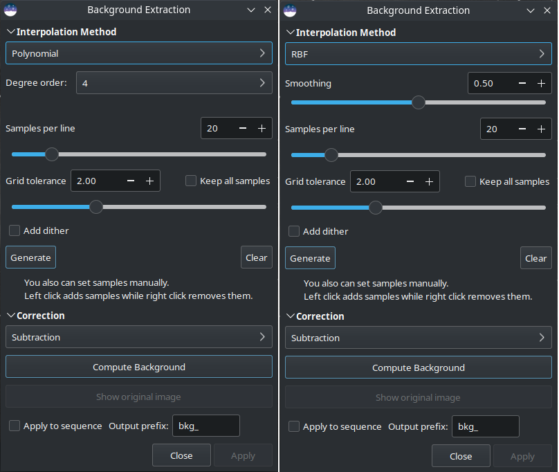

Background Extraction
=====================

The sky background often has an unwanted gradient caused by light pollution,
the moon, or simply the orientation of the camera relative to the ground. This
function samples the background at many places of the image and looks for a
trend in the variations and removes it following a smoothed function to avoid
removing nebulae with it.

   Background extraction dialog box. On the left is the polynomial version, on
   the right RBF.

Samples can be automatically placed by providing a density (:guilabel:`Samples per
line`) and clicking on :guilabel:`Generate`. If areas of the image are brighter than
the median by some factor :guilabel:`Grid tolerance` times sigma, then no sample
will be placed there.

.. tip:: If you have very strong gradients, for example when imaging in high
   Bortle urban skies, even the maximum grid tolerance may be insufficient. In this
   case you can check the :guilabel:`Keep all samples` checkbox and the full sample
   grid will be populated. You will then need to remove samples from actual astronomical
   objects manually.

After generation, samples can also be added manually
(left click) or removed manually (right click).

There are two algorithms to remove the gradient:

RBF
~~~

This is the most modern method. It uses the `radial basis function
<https://en.wikipedia.org/wiki/Radial_basis_function>`_ to synthesize a sky
background to remove the gradient with great flexibility. It requires a single
parameter which is present in the form of a slider: :guilabel:`Smoothing`. With
this value you can determine how soft or hard the transition between the sample
points is calculated. A high smoothing factor makes sense for large and uniform
gradients, and a correspondingly lower value for small, local gradations.

.. tip::
   Start with the basic setting (50%) and gradually tweak for optimal results.

.. admonition:: Theory
   :class: siriltheory

   Radial basis functions are functions of the form :math:`\phi(\mathbf{x}) = \phi(\| \mathbf{x} \|)`,
   whereby in our case we use the Euclidean norm :math:`\| \mathbf{x} \| = \sqrt{x_1^2 + x_2^2}`.
   The function :math:`f`, which describes the background model, can now be expressed as
   a linear combination

   .. math::

      f(\mathbf{x}) = \sum_i w_i \, \phi(\|\mathbf{x} - \mathbf{x_i}\|) + o

   where :math:`w_i` corresponds to the weights for the different sample points
   and :math:`o` corresponds to a constant offset.

   The requirement that the function :math:`f` should pass through the sample
   points results in the condition

   .. math::

      \begin{pmatrix}
         \phi(\mathbf{x}_1 - \mathbf{x}_1) & \phi(\mathbf{x}_1 - \mathbf{x}_2) & \dots & \phi(\mathbf{x}_1 - \mathbf{x}_N) & 1 \\
         \phi(\mathbf{x}_2 - \mathbf{x}_1) & \phi(\mathbf{x}_2 - \mathbf{x}_2) & \dots & \phi(\mathbf{x}_2 - \mathbf{x}_N) & 1 \\
         \vdots & \vdots & \ddots & \vdots \\
         \phi(\mathbf{x}_N - \mathbf{x}_1) & \phi(\mathbf{x}_N - \mathbf{x}_2) & \dots & \phi(\mathbf{x}_N - \mathbf{x}_N) & 1 \\
         1 & 1 & \dots & 1 & 0
      \end{pmatrix}
      \begin{pmatrix}
         w_1 \\ w_2 \\ \vdots \\ w_N \\ o
      \end{pmatrix}
      =
      \begin{pmatrix}
         y_1 \\ y_2 \\ \vdots \\ y_N \\ 0
      \end{pmatrix} \, ,

   which can only be fulfilled if the matrix on the left-hand side is invertible.
   With the right choice of function :math:`\phi` this can always be guaranteed [Wright2003]_.

   In addition, the summand :math:`s \, I` is added to the matrix on the left-hand
   side, where :math:`s` is a smoothing parameter and :math:`I` is the unit matrix.
   The summand causes a regularization, which results in a smoother result the
   larger the parameter :math:`s` is. This parameter can be changed with the
   :guilabel:`Smoothing` parameter of the dialog box.

   For the radial basis function, we use the thin-plate spline
   :math:`\phi(|\mathbf{x}|) = |\mathbf{x}|^2 \log(|\mathbf{x}|)`.

Polynomial
~~~~~~~~~~

This is the original and simplest algorithm developed in Siril. Only one
parameter is used in polynomial computation: the :guilabel:`Degree order`. The
higher the degree, the more flexible the correction, but a too high degree can
give strange results like overcorrection.

.. tip::
   A degree 1 correction can be very useful for when you want to remove the
   gradient on the subs.

.. warning::
   Background removal can be carried out on CFA images, but only if they have
   Bayer patterns. (It is not supported for X-TRANS patterns.) For Bayer patterned
   images, the image is treated as four spatially interleaved images, each
   corresponding to a CFA subchannel. Each subchannel is independently processed
   to remove its gradient and then the subchannels are recombined into the original
   interleaved pattern.

   The intended use for this is to remove linear gradients from sequence frames
   prior to using Drizzle on a Bayer patterned sequence, and in that case it is
   strongly recommended to use linear (polynomial order 1) gradient removal as with
   other pre-stacking gradient removal.

.. admonition:: Theory
   :class: siriltheory

   Polynomial functions are functions of the form

   .. math::
      \begin{equation}
          f(x)=a_nx^n+a_{n-1}x^{n-1}+\cdots+a_2x^2+a_1x+a_0
      \end{equation}.

   In Siril, the maximum degree allowed is :math:`n=4` and can be modified using
   the :guilabel:`Degree order` drop-down menu. Beyond this, the model is generally
   unstable and gives poor results.

General settings
~~~~~~~~~~~~~~~~

* **Add dither**: Hit this option when color banding is produced after
  background extraction. Dither is an intentionally applied form of noise used
  to randomize quantization error, preventing large-scale patterns such as
  color banding in images.

* **Correction**:

  * **Subtraction**: it is mainly used to correct additive effects, such as
    gradients caused by light pollution or by the Moon.
  * **Division**: it is mainly used to correct multiplicative phenomena, such
    as vignetting or differential atmospheric absorption for example. However,
    this kind of operation should be done by master-flat correction.

* **Compute Background**: This will compute the synthetic background and will
  apply the selected correction. The model is always computed from the original
  image kept in memory allowing the user to work iteratively.
* **Show original image**: Keep pressing this button to see the original image.

The background gradient of pre-processed image can be complex because the
gradient may have rotated with the acquisition session. It can be difficult to
completely remove it, because it’s difficult to represent it with a polynomial
function. If this is the case, you may consider removing the gradient in the
subexposures: in a single image, the background gradient is much simpler and
generally follows a simple linear (degree 1) function.

.. tip::
   Sometimes unsightly color banding appears after background extraction. When
   this happens, there are two things to check. Firstly, if the image is in
   16-bit, we strongly advise you to always use the 32-bit format. If, despite
   everything, you still observe such artifacts, the **add dither** option,
   explained above, is the solution to your problem.

   .. figure:: ../_images/processing/bkg_banding.png
      :alt: dialog
      :class: with-shadow
      :width: 100%

      When such banding occurs after gradient extraction. It can be solved with
      the **add dither** option (Courtesy of Nathan B.).

.. tip::
   Good results with the RBF algorithm generally require fewer samples than with
   the polynomial algorithm.

.. seealso::
   For more explanations, see the corresponding tutorial
   `here <https://siril.org/tutorials/gradient/>`_.

.. admonition:: Siril command line
   :class: sirilcommand

   .. include:: ../commands/subsky_use.rst

   .. include:: ../commands/subsky.rst

.. tip::
   The -existing command argument forces use of existing background samples.
   This option is primarily for use in conjunction with the Python module where
   ``SirilInterface.set_bgsamples()`` can be used to set custom background
   samples based on user-defined algorithms. If it is not provided, :ref:`subsky <subsky>`
   will automatically regenerate background samples. Note that the -existing
   option is not available with the seqsubsky command, because sequence frames
   are not necessarly registered at the time background subtraction is carried
   out, so the samples for one frame do not necessarily apply to another.

.. admonition:: Siril command line
   :class: sirilcommand

   .. include:: ../commands/seqsubsky_use.rst

   .. include:: ../commands/seqsubsky.rst

.. [Wright2003] Wright, Grady Barrett. Radial basis function interpolation:
   numerical and analytical developments. University of Colorado at Boulder,
   2003.
