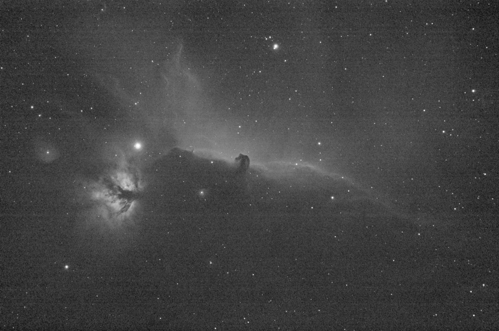

Banding Reduction
#################

In some cases, images may suffer from a banding defect. This is usually caused 
by the sensor and calibration by darks, bias and flats do not improve the 
images.

   Original image with visible banding.
   
.. figure:: ../_images/processing/banding_dialog.png
   :alt: dialog
   :class: with-shadow

   Banding Reduction dialog box.
   
The banding reduction window dialog has some parameters to optimize the 
processing:

* **Amount** defines the strength of the correction. The higher the value, 
  the stronger the correction.
* **Protect from Highlights** will ignore bright pixels when the option is
  checked.
* **1/Sigma Factor** will adjust the highlight protection. Higher value will 
  give a better protection.
* **Vertical banding** allows user to fix banding if bands are vertical.

Applying the following filter to the original image, with parameter values as
shown in the illustration, gives a nice result free of banding.
   

   Result after the filter has been run. No more bandings are visible.
   
This transformation can easily be applied to a sequence. You just have to 
define the transformation on the loaded image (with a sequence already loaded),
then check the :guilabel:`Apply to sequence` button and define the output prefix of 
the new sequence (``unband_`` by default).
   
.. admonition:: Siril command line
   :class: sirilcommand
   
   .. include:: ../commands/fixbanding_use.rst

   .. include:: ../commands/fixbanding.rst

.. admonition:: Siril command line
   :class: sirilcommand
   
   .. include:: ../commands/seqfixbanding_use.rst

   .. include:: ../commands/seqfixbanding.rst

