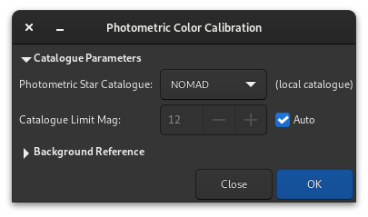

Photometric Color Calibration
*****************************

.. warning::
   The calibration of the colors by photometry **must** imperatively be carried
   out on a linear image whose histogram was not yet stretched. Otherwise,
   the photometric measurements will be wrong and the colors obtained without 
   guarantee of being correct.

Another way for retrieving the colors is to compare the color of the stars in 
the image with their color in catalogues, to obtain the most natural color in
an automatic and non-subjective way. This is the PCC (Photometric Color
Calibration) tool (:kbd:`Ctrl` + :kbd:`Shift` + :kbd:`P`). It can only work for 
images taken with a set of red, green and blue filters for colors, or on-sensor 
color. To identify stars within the image with those of the catalogue, an 
astrometric solution is required. Please see the :ref:`documentation of the 
plate solver module <astrometry/platesolving:Platesolving>`.

This method is less accurate than Spectrophotometric Color Calibration explained
below, however it can be performed using local catalogues and is therefore the 
best option when an internet connection is not available.

.. note::

        This technique is heavily dependent on the type of filter used. Using
        different kinds of R, G, B filters will not make a large difference,
        but using a Light pollution filter or no IR-block filters will make the
        solution deviate significantly and not give the expected colors. 

Since version 1.4, the two tools run independently: it is possible to run the
photometric analysis and color correction of the image only if the image has
been already plate solved. It also means different catalogues can be used for
PCC and astrometry. The tool is also available as the ``pcc`` command, so it can 
be embedded in image post-processing scripts.

   Photometric Color Calibration dialog window.

If the image was previously plate solved, turn on the
:ref:`annotations <astrometry/annotations:annotations>` feature to check that
catalogues align with the image. If the astrometric solution is not good
enough, please redo a plate solving.

* The **Catalog Settings** section allows you to choose which photometric 
  catalog should be used, NOMAD, APASS or Gaia DR3, as well as the limiting 
  magnitude.

  .. tip::
     The NOMAD and GAIA catalogs can be :ref:`locally installed <astrometry/annotations:offline annotation catalogues>`,
     while the APASS catalog requires internet access to obtain its
     contents.

     The local Gaia catalog used for PCC is the astrometric extract, which is
     a much smaller download than the whole SPCC catalog. If this is available
     it will be shown as the default.

  .. note::
     Whereas the NOMAD and APASS catalogs use the catalogued B-V index and
     estimate the effective temperature from this value, Gaia provides an
     accurately modelled effective temperature therefore when this catalog is
     used the Teff field is used directly, giving more accurate results.

* The **Star Detection** section allows you to manually select which stars will
  be used for the photometry analysis. It's better to have hundreds of them at
  least, so individual picking would not be ideal.
  
  .. figure:: ../../_images/processing/pcc_star_detect.png
     :alt: PCC star detection
     :class: with-shadow

* If desired, the **Background Reference** can be manually selected as 
  described in :ref:`Manual Color Calibration <processing/color-calibration/manual:Manual Color Calibration>`. 
  This can be useful in the case of nebula images where the background sky parts 
  are small.

  .. figure:: ../../_images/processing/pcc_bkg.png
     :alt: PCC background
     :class: with-shadow
 
When enough stars are found and the astrometric solution is correct, the PCC
will print this kind of text in the Console tab:

.. code-block:: text

        Applying aperture photometry to 433 stars.
        70 stars excluded from the calculation
        Distribution of errors: 1146 no error, 18 not in area, 48 inner radius too small, 4 pixel out of range
        Found a solution for color calibration using 363 stars. Factors:
        K0: 0.843	(deviation: 0.140)
        K1: 1.000	(deviation: 0.050)
        K2: 0.743	(deviation: 0.130)
        The photometric color correction seems to have found an imprecise solution, consider correcting the image gradient first

We can understand that 433 stars were selected from the catalogue and the image
for photometric analysis, but somehow, only 363 we actually used, 70 being
excluded. The line *Distribution of errors* explains for what reason they were
excluded: 18 were not found in the expected position, 48 were too big and 4
probably saturated. It is very common to have many stars rejected because they
don't meet the strict requirements for a valid photometric analysis.

We can also see that the PCC found three coefficients to apply to the color
channels to correct the white balance. The *deviation* here, which is the
average absolute deviation of the color correction for each of the star of the
photometric set, is moderately high. On well calibrated images without
gradient, with correct filters and without a color nebula covering the whole
image, devation would get closer to 0.

.. admonition:: Siril command line
   :class: sirilcommand

   .. include:: ../../commands/pcc_use.rst

   .. include:: ../../commands/pcc.rst
