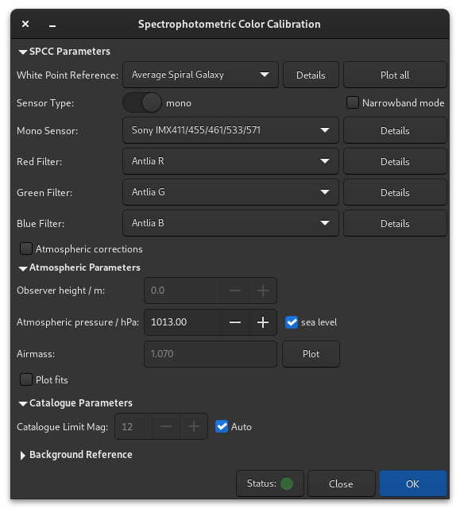

Spectrophotometric Color Calibration
====================================

.. warning::
   The calibration of the colors by photometry **must** imperatively be carried
   out on a linear image whose histogram was not yet stretched. Otherwise,
   the photometric measurements will be wrong and the colors obtained without
   guarantee of being correct.

Spectrophotometric Color Calibration (:kbd:`Ctrl` + :kbd:`Shift` + :kbd:`C`) is 
the newest method of color calibration available in Siril. This method uses the 
extensive spectral data available in the Gaia DR3 catalogue [GaiaDR3]_. This can
be accessed either through direct querying of the online catalogue or by downloading
a local extract and querying the local catalogue.

.. warning::
   Note that when the Gaia archive is offline for maintenance or due to a fault,
   Siril's SPCC functionality will not be available via the remote catalog.
   Fortunately the archive is normally very reliable, however a status indicator is built into the SPCC dialog. The archive status is checked when the dialog starts
   up and can be re-checked by clicking the status button.

   The offline Gaia SPCC extract will still work fine if the Gaia archive is offline.

   SpectroPhotometric Color Calibration dialog window.

.. tip::
   **What's the difference between SPCC and PCC? When should I use one rather 
   than the other?** SPCC is a more accurate version of PCC and renders the 
   latter obsolete. SPCC takes your setups sensor and filters into account. As 
   a result, the color produced is closer to "reality". The example in the
   picture below illustrates the difference in results.
   
   .. figure:: ../../_images/processing/pcc_vs_spcc.png
      :alt: comparison PCC
      :class: with-shadow
      :width: 100%
      
      Comparison between PCC (left) and SPCC (right): click to enlarge. 
      (Courtesy of Ian Cass)

Local SPCC Catalog
------------------
From 1.4.0 an offline SPCC catalog is available using Gaia DR3 data. Note that the
catalog is chunked into 48 files covering each level 1 HEALpixel.

.. admonition:: Theory
   :class: siriltheory

   HEALpix (Hierarchical Equal Area isoLatitude Pixelisation) is an algorithm for
   pixelising a sphere based on subdivision of a distorted rhombic dodecahedron.
   Mathematical details can be found on Wikipedia [Wiki_HEALPIX]_. Gaia sources
   use a Level 12 NESTED HEALpix scheme and the HEALpixel number is encoded into
   the source_id. The specification of the Gaia DR3 catalogue extracts and their
   file format is documented `here (PDF) <https://zenodo.org/records/14697486>`_.

   The nested nature of the scheme means that HEALpixels that are close together
   in the sky have numbers that are close together. The hierarchical property also
   means that it is possible to index sources in HEALpixels at a deep HEALpixel
   level and divide the catalog into chunks at a shallower level while still
   supporting a highly efficient catalog search algorithm.

It is possible to download the entire catalog or only the chunks you need. The
folder location to store the catalog files is set in
:menuselection:`Preferences->Astrometry`.

.. admonition:: Sirilpy script
   :class: sirilpython

   The easiest way to install the catalog is to use the built-in Python script
   :file:`Siril_Catalog_Installer.py` in the :menuselection:`Scripts->Python Scripts` menu.

   .. figure:: ../../_images/processing/cat_installer.png
      :alt: catalog installer interface
      :class: with-shadow
      :width: 50%

   This provides an interface that allows you to install either the whole catalog,
   or only the chunks that are visible from your observing latitude above a certain
   elevation, or only sets of chunks corresponding to certain themes (:guilabel:`Milky Way`,
   :guilabel:`Summer Triangle`, :guilabel:`Galaxy Season` etc.) Select the latitiude / elevation or area
   of interest if desired, and then select the selection method (:guilabel:`All`, :guilabel:`Visible
   from Latitude` or :guilabel:`Area of Interest`).

   You can preview the coverage using the :guilabel:`Preview coverage` button.

   .. figure:: ../../_images/processing/cat_preview.png
      :alt: catalog preview
      :class: with-shadow
      :width: 50%

   Finally, clicking :guilabel:`Install` will download, verify, uncompress and
   install the selected chunks and also set the catalog path in Siril's preferences.
   A default catalog path is suggested in the text entry widget, but can be changed
   to a different location if you prefer.

If you wish to install the offline SPCC catalog files manually, they can be downloaded
from `Zenodo <https://zenodo.org/records/14697692>`_. Either individual level 1
HEALpixels can be downloaded or the entire catalog can be downloaded as an archive.

.. tip::
   When you download "All Files" from the Zenodo record, the download is a zip
   archive that you will need to extract, however the zip archive is just a
   convenient way of bundling all of the individual files; the data files inside
   the zip archive are themselves compressed with bzip2 compression, and you will
   need to decompress the individual .bz2 files before Siril can use them. Support
   for this compression format is available by default in Linux and MacOS, and is
   provided in Windows by various archive programs including
   `7-Zip <https://www.7-zip.org/>`_ and `Pea-Zip <https://peazip.github.io/>`_,
   which are both Free and Open Source software.

All compressed files have accompanying sha256sums and there is a file containing
all the sha256sums of the uncompressed files as well, for additional validation.
The Zenodo record also provides a DOI reference that can be used to cite the
dataset if you use it in academic work.

Siril uses an optimized extract of the Gaia DR3 xp_sampled datalink product. As
with the astrometric extract, the offline catalogue is capped at the 127 brightest
sources per level 8 HEALpixel. The catalogue contains fewer sources than the
astrometric extract as xp_sampled spectra are typically only provided for sources
brighter than magnitude 17.6 and therefore more HEALpixels in emptier parts of the
sky have fewer than 127 sources compared with the astrometric extract (i.e. these
HEALpixels contain all the available Gaia DR3 sources with xp_sampled data),
but this approach still avoids overpopulation of the catalogue in extremely
crowded parts of the sky while providing the best SNR. In those HEALpixels with
fewer than 127 xp_sampled sources, the local catalog is as comprehensive as using
the online Gaia archive directly.

The xp_sampled is converted from float32 to float16 data with an additional byte
setting the exponent to be applied to the xp_sampled data for the source to
overcome limitations on exponents expressible with float16. This is entirely
justifiable given the error bars on the xp_sampled data and makes no practical
difference to the accuracy of the results. It means that we can provide a highly
effective, purpose-optimized local SPCC catalogue in under 21GB of data.

How it Works
------------
SPCC requires knowledge of your sensor and the RGB filters you use. These are
provided through an :ref:`online repository <spcc-database>` which Siril will sync,
either automatically at startup or manually when required. Sensor and filter
information is updated via the same synchronization method as used for the online
scripts repository. (This means that as data on new filters or sensors becomes
available it can be added to the repository without requiring an update to the
application.)

In the GUI you select your sensors and filters from the widgets in the SPCC dialog.
Don't worry if there isn't an exact match for your equipment, just pick the
closest option, or the appropriate default option.  You also need to select a
white reference. The default reference is the Average Spiral Galaxy reference
which is suitable for a wide range of astrophotographic scenes, however there is
an extensive range of galaxy and star types to choose from. The Sun's spectral
type is G2(v) so if you want to balance your image using sunlight as a white
reference, you would pick **Star, type G2(v)** from the list.

SPCC then uses the stellar spectra in Gaia DR3 and knowledge of your imaging
sensor and filters to compute for each star in the catalogue that matches a star
detected in the image by Siril the expected flux in each color channel. It then
compares this with the actual flux measured in each channel using Siril's photometric
capabilities.

Given the sensor and filter knowledge, SPCC computes the expected flux in each
channel for the specified white reference. A robust linear fit is obtained to give
the best fit of catalogue to image R/G and B/G flux ratios for each star and for
the white reference. This fit is used to derive correction coefficients which are
applied multiplicatively to each channel, resulting in spectrophotometrically
accurate color channels.

Your image must be plate solved for SPCC to work: if it is not already, this
should be done with the dedicated tool. It is important to make sure that the plate
solving information is correct, as some software is known to add inaccurate WCS
data to images.

Graphical Interface
-------------------

* **Selection of Sensor** In order to select your sensor, ensure that the mono /
  OSC toggle button is set correctly. You will then see the appropriate dropdown
  to choose from the available sensors.
* **Selection of Filters** SPCC can operate in two modes.

  * The default mode is broadband operation. In this mode, the :guilabel:`Narrowband mode`
    check box should be unchecked. You can choose either red, green and blue filters
    (for composited images made with a mono sensor) or OSC filters, for example light
    pollution filters, for images made with an OSC sensor.

    .. warning::
       If you select a DSLR OSC sensor (e.g. a Canon EOS 600D) an additional widget
       will become visible to select a DSLR Low Pass Filter. This allows you to tailor
       whether your camera has been astro-modded or not. You **must** select an option
       here or the process will complain that you haven't set all the necessary filters!

       Options exist for Canon and Nikon OEM low-pass filters as well as the popular
       Baader BCF astro-mod filter that lets Ha and Sii through but stil blocks longer
       IR wavelengths and "Full spectrum" which is modelled as a perfect clear filter.

       If you have an unmodified camera of a different model or brand, select any of
       the Canon or Nikon low-pass filters: the effect is very minor as these wavelengths
       are right at the edge of human visual perception anyway.
  
  * By checking the :guilabel:`Narrowband mode` check box, you enable narrowband
    mode. This is intended either for images composited from narrowband filters
    used with a mono sensor or for images made using an OSC sensor with a dual,
    tri-band or quad band narrowband filter. In this mode the available controls
    change, and for each color channel you enter the nominal wavelength and
    bandwidth of the filter passband. For ultra-narrowband mono filters the
    passband may be as little as 3nm; for a quadband OSC filter like the Altair
    QuadBand V2 the passbands may be as much as 35nm. Note that for a HOO
    composition where two channels are set to the same data, the nominal
    wavelength and bandwidth should be set equal in the SPCC interface too.
    
    .. figure:: ../../_images/processing/Veil_HOO.png
       :alt: dialog
       :class: with-shadow
       :width: 100%
      
       Calibrated HOO image. Image by Cyril Richard.

    .. tip:: Some manufacturers specify a center wavelength and FWHM. It is fine
             to use the FWHM as the bandwidth: these filters have very sharp
             cutoffs.
             
    .. warning:: Don't expect to retrieve the Hubble palette for SHO imaging using 
                 the wavelengths of the SII, :math:`\mathrm{H}\alpha` and OIII 
                 filters respectively. The result will be an image with a huge 
                 green cast. This is easily explained by the fact that the SII 
                 emission line is much fainter than that of hydrogen, and the 
                 SPCC gives a representation of real intensities. But this is 
                 not the case in the Hubble palette. In fact, :ref:`manual color 
                 calibration <processing/color-calibration/manual:Manual Color Calibration>` will 
                 give better results.

    .. figure:: ../../_images/processing/SHO.png
       :alt: dialog
       :class: with-shadow
       :width: 100%
      
       SHO image calibrated by SPCC compared to the same, manually calibrated 
       one. The entire nebula was taken as a white reference during manual 
       calibration. Image by Cyril Richard.

* **Selection of DSLR Low Pass Filter (LPF)** DSLRs contain a low-pass filter (sometimes
  also called a 'hot mirror'. These reduce transmittance at wavelengths of interest
  to astronomers (Ha at 656nm and S-II at 674nm). If the selected OSC is a DSLR, a
  dropdown will be provided from which you can the appropriate LPF profile. Options
  exist for stock LPFs as well as astro-modified LPFs and an ideal **Full spectrum**
  filter model for if the LPF has been removed altogether.
* **Selection of White Reference** SPCC requires an absolute white reference spectrum.
  The default is **Average Spiral Galaxy** and the source spectra used to create
  this white reference are taken from the SWIRE templates [SWIRE]_ in a manner consistent
  with other astrophotography software providing the same white reference. A wide
  range of other white references is available, covering the full range of galaxy
  and star classifications [Stellar]_. If you wish to use sunlight as your white reference,
  you would choose the white reference **Star, type G2(v)** as the Sun is a type
  G2(v) star.
  
  .. figure:: ../../_images/processing/WR_Galaxy.png
     :alt: dialog
     :class: with-shadow
     :width: 100%

     Graphs showing white reference data from spiral galaxies. At around 350 nm, 
     the Average Spiral Galaxy data become identical to the Sc galaxies, which 
     are also a good representation of the white reference.
     
  .. figure:: ../../_images/processing/NGC4414.jpg
     :alt: dialog
     :class: with-shadow
     :width: 100%
     
     NGC 4414 is a great example of a Sc-type galaxy, the type closest of the
     average spiral galaxy used as white reference by default. Image Credit: 
     NASA, ESA, W. Freedman (U. Chicago) et al, & the Hubble Heritage Team 
     (AURA/STScI), SDSS; Processing: Judy Schmidt.

  .. tip:: **Summary of Stellar Spectral Classifications**
           Stellar classifications have two parts, a Morgan-Keenan type and a
           Luminosity index.

           The first part of the spectral classification (G2 in the case of the Sun)
           takes one of the following letters: O, B, A, F, G, K, M. O represents
           extremely hot blue stars, while M represents cool red stars. The sun is
           roughly in the middle of the spectrum. The number represents intermediate
           cases, for example a B5 star is halfway between type B and type A.

           The second part of the spectral classification is the luminosity index
           ranging from i to v. Stars with luminosity index i are supergiants,
           whereas stars with luminosity index v are dwarfs. Main sequence stars
           such as the sun have a luminosity index of iv.
           
  .. figure:: ../../_images/processing/Stars_KG.png
     :alt: dialog
     :class: with-shadow
     :width: 100%

     Graphs showing white reference data for a set of two different star classes,
     G and K.
     
  .. figure:: ../../_images/processing/avg_vs_M_white_ref.png
     :alt: dialog
     :class: with-shadow

     Difference in color calibration depending on the choice of white reference. 
     On the left, an M-type star, on the right the average spiral galaxy. Please 
     note that the data are linear, and only an autostretch has been applied to 
     the visualization.

* **Atmospheric Correction**
  Siril's SPCC supports atmospheric correction. When imaging from Earth we image
  through the atmosphere. This does not have perfect transmittance and therefore
  acts as another, non-optional, filter in the imaging chain between the sensor
  and the astronomical object. Whether or not to correct for this is an artistic
  choice each astrophotographer must make, but the option is provided.

  .. admonition:: Theory
     :class: siriltheory

     Atmospheric extinction arises from several sources. The most important are:

     * Rayleigh scattering. This is the elastic scattering of light by particles
       that are small compared with the wavelength of light. The strong wavelength
       dependence of the Rayleigh scattering (:math:`\approx λ^{−4}`) means that shorter (blue)
       wavelengths are scattered more strongly than longer (red) wavelengths.

     * Aerosol scattering. This is scattering of light by particles that are
       larger than the wavelength of light. This is quite variable but (in the
       absence of significant short term dust or smoke effects) relatively spectrally
       flat and less significant than Rayleigh scattering.

     * Molecular absorption lines.

     Siril models only Rayleigh scattering. This is the most important contribution
     in most atmospheric conditions, and is highly predictable making it easy to
     model without requiring the user to provide complex data.

     The formula for the Rayleigh transmittance of the atmosphere as a function of
     wavelength :math:`\lambda` nm, observer height :math:`H` m and pressure
     :math:`p` hPa is:

     :math:`\tau_R(\lambda, H, p) = \left( \frac{p}{1013.25} \right) \left( 0.00864 + 6.5 \times 10^{-6} \cdot H \right) \lambda^{-(3.916 + 0.074 \lambda + \frac{0.050}{\lambda})}`.

     Under normal
     circumstances aerosol scattering has a roughly flat response in the visible
     region. This changes in specific conditions, for example when there is high
     atmospheric smoke particle concentration after wildfires or, in parts of Europe,
     when Saharan dust is carried into the atmosphere. However these effects are
     very difficult to model accurately as they depend on the concentration of sand
     or smoke particles in the atmosphere at the time. Siril therefore does not
     model this effect.

     The main molecular absorption lines in the visible spectrum are the Chappuis
     stratospheric ozone bands and the Fraunhofer B molecular oxygen absorption
     line. However the Fraunhofer B line is very narrow and does not have a
     significant effect on overall calibration. The Chappuis bands are broad but
     with a low peak absorption, with a much smaller overall impact than Rayleigh
     scattering. Molecular absorption bands are not currently modelled in Siril.

  When selecting the :guilabel:`Atmospheric correction` check box, the following options
  become available:

  - Observer Height. This allows setting of the observer height, which is used in
    the Rayleigh extinction calculation. Set this to the altitude of your observatory
    above sea level. Some capture software sets the FITS header ``SITEELEV`` card: if
    this is present, the height from this card will be used, otherwise the value
    is editable and defaults to 10 m.

  - Atmospheric pressure. This allows setting atmospheric pressure at the time of
    observation. For convenience it can be specified as sea level pressure (as
    provided by weather forecasts) or as local pressure (as measured by a barometer
    at the observatory). In case you are unsure, the default is standard atmospheric
    pressure at sea level (1013.25 hPa).

    .. admonition:: Theory
       :class: siriltheory

       If the pressure is provided as a sea-level pressure measurement, the local
       pressure at the observer's height is calculated
       according to the barometric formula:

       :math:`P(h) = P_0 \left( 1 - \frac{L h}{T_0} \right)^{\frac{g M}{R L}}`,

       where:

       * :math:`L = 0.0065~\text{K}/\text{m}` (Temperature lapse rate),
       * :math:`T_0​ = 288.15~\text{K}` (Sea level standard temperature),
       * :math:`g = 9.80665~\text{m}/\text{s²}` (Acceleration due to gravity),
       * :math:`M = 0.0289644~\text{kg}/\text{mol}` (Molar mass of Earth's air),
       * :math:`R = 8.3144598~\text{J}/(\text{mol}·\text{K})` (Universal gas constant).

  - Airmass. This is not an editable parameter but shows the airmass that will be
    used in the calculations. It is obtained, in order of preference, from the
    ``AIRMASS`` FITS header card; by calculation using the ``CENTALT`` FITS header card; or
    as a last resort by using the average zenith angle of all parts of the more than
    30° above the horizon. The tooltip shows which source the used figure is based on.

    .. admonition:: Theory
       :class: siriltheory

       If the ``AIRMASS`` header is unavailable the calculation used to derive airmass from
       zenith angle is calculated in accordance with [Young1994]_:

       :math:`X(z) = \frac{1.002432 \cos^2 z + 0.148386 \cos z + 0.0096467}{\cos^3 z + 0.149864 \cos^2 z + 0.0102963 \cos z + 0.000303978}`.

The interface allows you to view details of the selected sensor, filter and white
reference using the :guilabel:`Details` button next to each combo box. From the
details information box that this brings up you also have the option to plot the
Quantum Efficiency (for sensors) or transmittance (for filters) or relative
photon count (for white references) against wavelength. A :guilabel:`Plot All`
button is also available in the main SPCC dialog which allows you to see the
responses of all your filters and your sensor and the white reference spectrum
all plotted together.

.. figure:: ../../_images/processing/SPCC_data_HOO_2024-01-23T13.18.47.png
   :alt: dialog
   :class: with-shadow
   :width: 100%

   Plotting all the responses of all your filters and your sensor and the white
   reference spectrum all plotted together

When you are happy, click :guilabel:`Apply` and SPCC will run. It will cache catalogue data
but the first time you apply it to an image it will take a few seconds to perform
the online catalogue searches and retrieve the source and spectral data. SPCC will
then be applied to the image. Additional plots showing the linear fit of the
catalogue Red / Green and Blue / Green to image Red / Green and Blue / Green
ratios.

.. figure:: ../../_images/processing/SPCC_plots.png
   :alt: dialog
   :class: with-shadow
   
   By default, Siril outputs graphs showing the fits used in the process. In 
   this example the magnitude was limited to 17.
   
.. tip::
   **How do I process L-RGB images?** We recommend processing only RGB with SPCC. 
   The L layer must be added at a later stage, when the histograms have been 
   stretched.
   
.. tip::
   For images taken with an OSC sensor, we recommend using 
   :ref:`Bayer Drizzle <preprocessing/drizzle:Drizzle>` to recover image colors. 
   This ensures more accurate colors as shown in the
   following image.
   
   .. figure:: ../../_images/processing/spcc_Bayer_Drizzle_vs_vng.png
      :alt: dialog
      :class: with-shadow
      :width: 100%
   
      SPCC applied identically to the same image. On the left, conventional 
      demosaicing using the VNG algorithm; on the right, the Bayer Drizzle 
      technique. A dominant green hue is clearly visible on the conventionally 
      demosaiced image. **Note** that the VNG algorithm was chosen for this
      example because the effects explained here are more pronounced. However, 
      in Siril, the default demosaicing algorithm is RCD. Click to enlarge image.

.. _spcc-database:
    
SPCC filter and sensor database
-------------------------------

Converting the Data
'''''''''''''''''''

The format used for the database is JSON (a lightweight data-interchange format derived from JavaScript object notation). We recommend starting with an existing file from the database that suits your needs and saving it under the name of your sensor or filter. You can then simply replace the values in the file with the data you have obtained.

- In the ``wavelength`` array, enter your wavelength measurements. Make sure to properly set the ``units`` field to one of the following values: ``angstroms``, ``nm``, ``micrometres``, or ``m``.

- In the ``values`` array, enter either:
  
  - Transmittance values for filters
  - Quantum efficiency values for sensors

  Set the ``range`` field according to your data scale (e.g., ``"range": 100`` if your values are percentages, ``"range": 1`` if they are normalized to 1).

How to Contribute
'''''''''''''''''

The SPCC database is designed to store JSON files of OSC/monochrome sensors and filters available in the market. Its primary objective is to gather extensive data, fostering collaboration within the community.

We greatly value community contributions and encourage active participation. We are in need of data spanning ideally from 300nm to 1100nm. Software tools can be employed to extract curves/charts found online, and contacting manufacturers directly for data is also an option.

Read `this page <https://siril-contrib-doc.readthedocs.io/en/latest/SPCCDatabase.html>`_  and help us by contributing.

.. important::
   **We do not include narrowband filters**. These highly specific filters are synthesized in Siril, ensuring precision. This also applies to duonarrowband filters.

JSON File Format Reference
''''''''''''''''''''''''''

Here is the template for the JSON files used in the SPCC database::

    [
      {
        "model": "sensor model / filter set",
        "name": "sensor / filter name",
        "type": "MONO_SENSOR | OSC_SENSOR | MONO_FILTER | OSC_FILTER | OSC_LPF | WB_REF",
        "dataQualityMarker": 1 - 5,
        "dataSource": "Describe where the data came from",
        "manufacturer": "Manufacturer name",
        "version": 1,
        "channel": "RED | GREEN | BLUE | LUM",
        "wavelength": [Comma separated array of wavelengths],
        "values": [Comma separated array of values]
      }
    ]

Important Notes
~~~~~~~~~~~~~~~

* Definition of the ``dataQualityMarker`` field:

  1. Data of unknown provenance. **Not accepted** for the siril-spcc-database repository.
  2. Data scanned from OEM or other reputable plots in image format.
  3. Lower resolution tabulated data provided by the OEM, or academic data relating to ideal standard filter transmittance (e.g. generic standard photometric filters).
  4. High resolution (no more than 2nm spacing) tabulated data provided by the OEM.
  5. Data specific to your own filter which you have personally calibrated using appropriate equipment. This is the highest possible quality marker and will never be given to .json files in the repository which can only ever be generic to an equipment model, not specific to your individual equipment item. Note that the actual quality of this data is entirely dependent on the quality of your calibration equipment - the old adage "garbage in, garbage out" applies.

* The ``model`` name requirements:

  - Must be identical for all related JSON objects in a set
  - Examples:
  
    - RGB filter set: ``"model": "Chroma RGB"``
    - OSC sensor: ``"model": "ZWO ASI2600MM"``

* The ``channel`` field:

  - Required only for ``"type": "OSC_SENSOR"`` or ``"type": "MONO_FILTER"``
  - For OSC sensors, include one JSON object per channel (``RED``, ``GREEN``, ``BLUE``)
  - Preferred channel order: ``RED``, ``GREEN``, ``BLUE``

* The ``wavelength`` array requirements:

  - Minimum coverage: 380nm to 700nm
  - Maximum useful range: 336nm to 1020nm (Gaia DR3 spectra limits)
  - Values must be monotonically increasing
  - No duplicate values allowed
  - Must use specified units (``angstroms``, ``nm``, ``micrometres``, ``m``)
  
  .. note::
   If your sensor data only extends down to 400nm (which is common with some 
   manufacturers), it is acceptable to extrapolate a single point at 380nm. 
   The sensor response below 400nm typically follows a predictable pattern 
   across different sensors. Adding this extrapolated point at 380nm is 
   preferable to letting the curve end at 400nm, which would effectively treat 
   all response below 400nm as zero. The impact of this extrapolation is minimal 
   since the CIE 1931 response is very low in this wavelength range.

* The ``values`` array requirements:

  - For filters: contains transmittance values
  - For sensors: contains quantum efficiency values
  - Set appropriate ``range`` value (e.g., 100 for percentages)
  - Siril scales all values to 0.0-1.0 range internally

 
Saved Preferences
-----------------
As most users are likely to do most of their imaging with one setup, or maybe two,
it would be tedious to reselect the sensor and filters each time. The user choices
are therefore automatically remembered when set and restored next time the tool is
used, even if Siril is closed and restarted in between. This works using the
preferences system but there is no need to use the preferences dialog to remember
the set sensor and filters, it is done automatically.

The chosen white reference is not remembered: the default Average Spiral Galaxy is
a suitable choice for most astronomical scenes, and alternative white references
would normally be set for a specific image to draw out a particular aspect of the
color.

.. admonition:: Siril command line
   :class: sirilcommand

   .. include:: ../../commands/spcc_use.rst

   .. include:: ../../commands/spcc.rst

   .. include:: ../../commands/spcc_list_use.rst

   .. include:: ../../commands/spcc_list.rst

References
----------

.. [GaiaDR3] Vallenari, A., et al. "Gaia Data Release 3-Summary of the content 
   and survey properties." Astronomy & Astrophysics 674 (2023): A1.
   99(613), 191.
   
.. [SWIRE] https://www.iasf-milano.inaf.it/~polletta/templates/swire_templates.html

.. [Stellar] https://www.eso.org/sci/facilities/paranal/decommissioned/isaac/tools/lib.html

.. [Wiki_HEALPIX] https://en.wikipedia.org/wiki/HEALPix

.. [Young1994] https://opg.optica.org/ao/viewmedia.cfm?uri=ao-33-6-1108&seq=0
