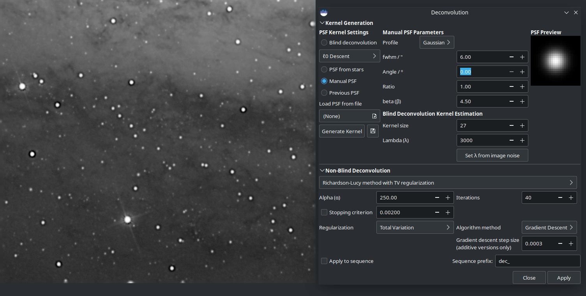
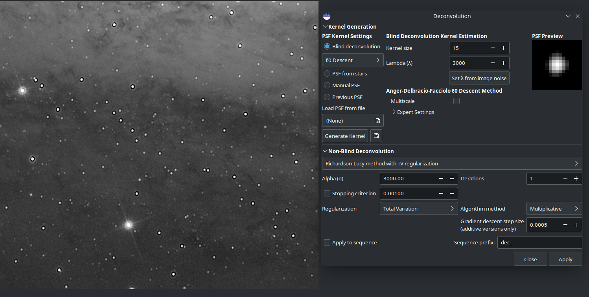
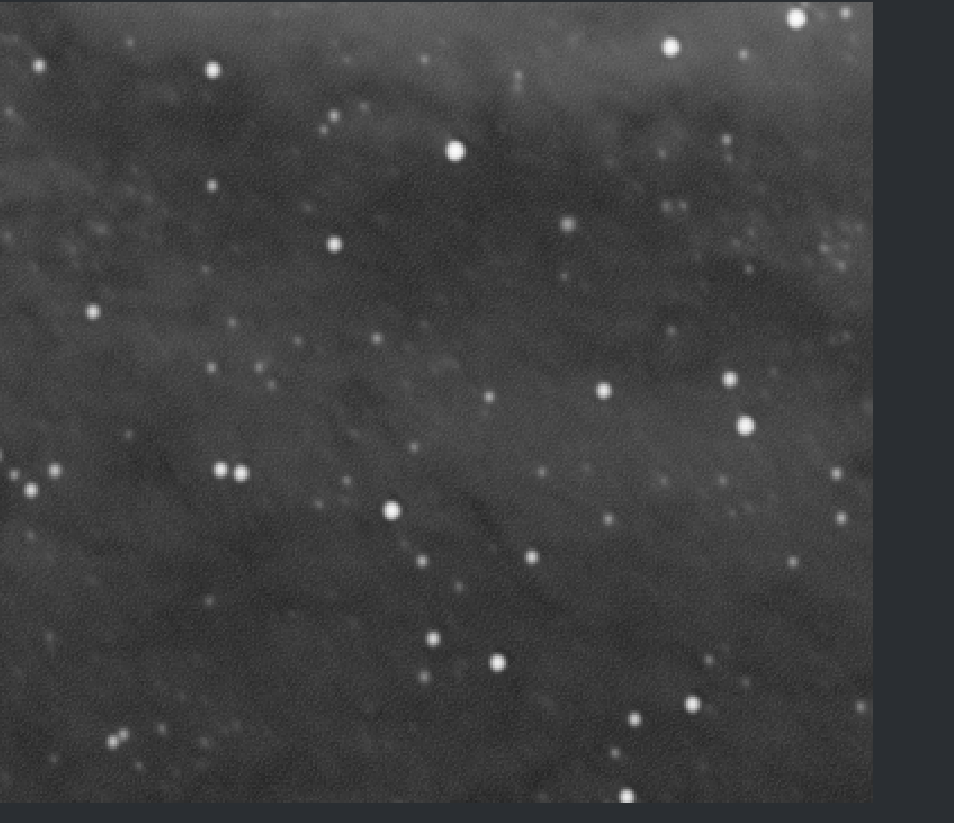
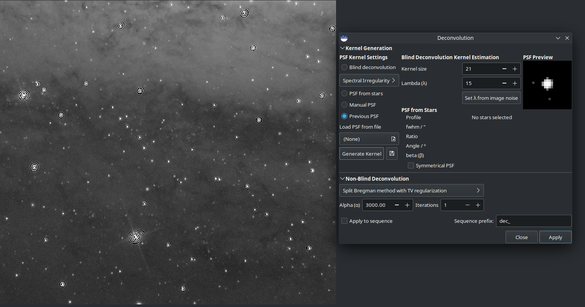

Deconvolution
#############

Deconvolution is a mathematical tool to compensate for blurring or distorting 
effects in an image. The true scene is not what is recorded on your sensor - 
you record an estimate of the true scene convolved by a PSF (in mathematical
terms, the "blurring PSF" that represents atmospheric distortion, physical
properties of your telescope, motion blur and so on, degrading your estimate).
Deconvolution can, to an extent, reverse this image degradation. However, it is
important to say up front that deconvolution is what mathematicians call an
ill-posed problem (like most inverse problems). Ill-posed means that either a
solution may not exist, if a solution does exist it may not be unique, and it
may not have continuous dependence on the data. Essentially it means
deconvolution is, even theoretically, really hard and there are no guarantees
it will work.

All this is made even harder when we don't know exactly what the PSF is
that we're trying to remove. In astronomy we can in theory get an idea of the 
PSF by the effect of blurring on the point sources (stars) that we are
imaging. However sometimes the true PSF isn't constant across the
image, sometimes other factors such as star saturation prevent the star PSF 
being an entirely accurate estimate of the PSF, and sometimes (for
example lunar imaging) there are no stars.

Siril aims to provide a flexible approach to deconvolution. There are several 
options for defining or estimating the PSF, and several deconvolution
algorithms to choose from for the final stage of deconvolution once the
PSF is defined.

.. figure:: ../_images/processing/deconv.gif
   :alt: dialog
   :class: with-shadow
   :width: 100%
   
   Example of deconvolution on star field.

Deconvolution is accessed through the :guilabel:`Image Processing` menu or using
Siril commands.

.. figure:: ../_images/processing/deconv_dialog.png
   :alt: dialog
   :class: with-shadow
   
   Dialog box of the deconvolution tool.

Overview of Usage
=================

* To generate a deconvolution PSF, select the required PSF
  generation method and press :guilabel:`Generate PSF`. This can be 
  performed separately from the actual deconvolution so that the user can see 
  the effect of changing the PSF parameters.

* Siril only generates monochrome PSFs as this is the most common use case and
  simplifies the user interface. However, three monochrome PSFs can be saved
  and composited to produce a 3-channel PSF which can be loaded and used to
  deconvolve 3-channel images.

* To apply deconvolution to a single image, select the required PSF
  generation method and press :guilabel:`Apply`. If a blind PSF estimation
  method has previously been run, the method will automatically be set to 
  :guilabel:`Previous PSF`, in order to avoid unnecessarily recalculating 
  the PSF.

* To apply deconvolution to a sequence, proceed as above but ensure that you
  activate the :guilabel:`Apply to Sequence` checkbox. You may also specify a 
  custom prefix to give to the output sequence: if no other prefix is provided,
  the default (``dec_``) will be used.

* When deconvolving a sequence, the PSF will be calculated only for the
  first image. The same PSF will be re-used for all images in the sequence.

Overview of Blur Kernel Definition Methods
==========================================

* :math:`\boldsymbol{ℓ_0}` **Descent**: This is the default PSF estimation method based on
  work by Anger, Delbracio and Facciolo. The parameters do not generally 
  require adjustment, except that for particularly large PSFs you may wish
  to try the multiscale PSF estimation model. Multiscale is off by default as
  during development it was noted to have a tendency to produce rather 
  unnatural results with the more common small to medium PSF sizes.

* **Spectral Irregularities** [Goldstein2012]_: This PSF estimation method is offered as an
  alternative. In general it does not perform as well as the :math:`ℓ_0` descent 
  method, however it may be useful if you discover an image where the default 
  method does not give good results. For this method the latent sharp image 
  needs not to contain any edges as long as the spectral decay model is 
  respected. On the other hand, the :math:`ℓ_0` descent assumes a similar model 
  (since edges have the same spectral decay), but requires to have sparse 
  gradients and be contrasted, thus edges to be in-phase, so theoretically this
  model may work better on low contrast starless images. Some experimentation 
  is likely required to find the algorithm that best fits your data.

* **PSF From Stars**: This method models a PSF from the average PSF of
  the selected stars. It is important to be selective about the stars you 
  choose: they must not be saturated as that would give a gross distortion of 
  the PSF estimate, but they must also not be so faint that Siril's
  star analysis functions provide inaccurate measurements of the stars. The 
  stars chosen should be reasonably bright, fairly central to the image and in 
  an area of the image with a fairly constant background. Once stars are 
  selected, you can pick either a Gaussian or Moffat star profile model and when
  executing the deconvolution the PSF will be synthesized from the
  average parameters of the selected stars.
  If no stars are selected, Siril will attempt to autodetect stars with a peak
  amplitude between 0.07 and 0.7, with a Moffat profile. This range avoids
  saturated stars as well as those that are too faint to give an accurate
  solution, and generally provides good results.

* **Manual PSF**: This method allows you to define a PSF manually.
  Gaussian, Moffat or disc PSF models can be defined. Note that the FWHM is
  specified in pixels, not arc seconds. The Gaussian and Moffat models are 
  suitable for deconvolving the shapes of stars resulting from atmospheric 
  distortion; the disc PSF model is suitable for deconvolving the effect of
  being slightly out of focus.

* **Load PSF from file**: This method allows you to load a PSF from any
  image format supported by Siril. The provided PSF must be square (it will
  be rejected if not square) and should be odd (it will be cropped by one pixel
  in each direction if not odd, but this will give a slightly off-centre PSF
  and is not optimal compared with providing an odd PSF in the first place).
  Either monochrome or 3-channel PSFs may be loaded. If a 3-channel PSF is
  loaded in conjunction with a monochrome image, the evenly-weighted luminance
  values of the PSF will be used. If a 3-channel PSF is loaded together with
  a 3-channel image then each channel of the image will be deconvolved using
  the corresponding channel of the PSF. If a monochrome PSF is loaded together
  with a 3-channel image then the image will be converted to the LAB colour
  space and the L (Luminance) channel will be deconvolved using the monochrome
  PSF for computational efficiency, and the deconvolved L will be recombined
  with the A and B channels and converted back to RGB.

* **Previous PSF**: This method allows reuse of the previously estimated 
  PSF. It is mostly of use with the blind PSF estimation methods: if you
  are content with the estimated PSF but wish to make a number of test runs
  using different parameters for the final stage of deconvolution, you can 
  reuse the previous PSF and save some computation time.

* Once estimated, PSFs may be saved if desired. If Siril is compiled with
  libtiff support then the PSF will be saved in 32-bit TIFF format, with the
  same filename as the current image but date-and-time-stamped and suffixed with
  ``_PSF``. If Siril has been built without libtiff support, the PSF will be
  saved as a FITS file. While this is Siril's primary format for astronomical
  image files, TIFF is preferred for PSFs: the disadvantage of using the FITS
  format for PSFs is potential reduced compatibility with image editors that
  you may wish to use to edit or examine the saved file.
  
.. tip::
   If the blind generation of a deconvolution PSF can be done on linear and
   non-linear data, the use of a PSF from star PSF can only be done on
   linear images. Otherwise the PSF values would not be valid.

.. tip::
   If a ROI is set, blind PSF estimation methods will calculate the PSF from the
   ROI rather than the whole image. If you do wish to calculate a PSF from the
   whole image you must clear the ROI before estimating the PSF, then set the ROI
   to apply a preview. However, you also have the option of calculating the PSF
   only from a selected part of the image. This may be desirable if you have
   optical aberrations close to the edge of the image and wish to estimate the
   PSF from the central area only.

Overview of Non-Blind Deconvolution
===================================

* **Richardson-Lucy Deconvolution** [Lucy1974]_: This is the default non-blind deconvolution
  algorithm. It is an iterative method, famous for its use in correcting
  image distortions in the early operating period of the Hubble Space Telescope,
  and in Siril is regularized using either the Total Variation method, which aims
  to penalize the algorithm for amplifying noise, or the Frobenius norm of the
  local Hessian matrix. This regularization is based on second derivatives.
  As well as regularization an early stopping parameter is provided,
  which allows the algorithm to be halted early once its rate of convergence 
  falls below a certain level. Increasing the value of the early stopping 
  parameter can reduce ringing around stars and sharp edges.
  Two formulations of the Richardson-Lucy algorithm are provided: the
  multiplicative formulation and the gradient descent formulation. The latter
  can allow better control, as the gradient descent step size can be altered
  (the downside of this is that by using more small steps, more iterations are
  required   to reach the same level of convergence). The bigger advantage of
  the gradient descent method is that it allows more regularization to be used
  - this can be problematic in the multiplicative Richardson-Lucy algorithm as
  the regularization term appears in the denominator and small values here (strong
  regularization) can cause instability. Siril will use naive convolution for
  small kernel sizes and FFT-based convolution for larger kernel sizes where FFTs
  provide a more efficient algorithm. (This is automatic and requires no user
  intervention.)

* **Wiener Filtering Method**: This method is a non-iterative deconvolution
  method. It models an assumed Gaussian noise profile, i.e. noise modelled by
  a constant profile. The constant alpha is used to set the regularization
  strength in relation to the noise level. As with the other algorithms, a
  smaller value of alpha provides more regularization. This algorithm can be
  good for lunar images where the noise regime is Gaussian not Poisson, but
  usually works badly on deep space imagery where the noise still tends to have
  a Poisson character.

* **Split Bregman Method**: This method is used internally within the blur 
  PSF estimation processes, and is also offered as a final stage
  deconvolution algorithm. It is a commonly used algorithm in solving convex 
  optimization problems. This algorithm is also regularized using a total 
  variation cost function. It does not perform as well as Richardson-Lucy on 
  starscapes but may be considered for starless images or lunar surface images.

.. tip::
   Choice of deconvolution method is very important to obtaining good results.
   Generally for DSO images it is important to use a Richardson-Lucy method:
   both the Split Bregman and Wiener methods give poor results around stars
   because of the extreme dynamic range. For linear images it is usually best
   to use the gradient descent Richardson-Lucy methods, and if ringing occurs
   around bright stars then reduce the step size. This approach reduces the impact
   of each iteration therefore more iterations are required, but it does mean
   that you can achieve finer control taking deconvolution just up to the point
   where artefacts start to form and then backing off very slightly. For stretched
   images the multiplicative Richardson-Lucy algorithms may be used.

.. tip::
   For stacked lunar and planetary images the Split Bregman or Wiener methods
   can be more appropriate. These methods do not generally require iteration
   in the way that Richardson-Lucy does, and they may be better suited to the
   noise characteristics of stacked, high signal-to-noise ration images. (The
   Richardson-Lucy algorithm is based on an assumption of Poisson noise, which
   is usually true for DSO imaging, whereas the Wiener method implemented here
   assumes a Gaussian noise distribution which may fit stacked planetary / lunar
   images better).

Parameters and Settings
=======================

.. rubric:: General Settings

* PSF size. The input PSF size should be chosen sufficiently large to
  assure that the PSF is included in the specified domain. However, setting
  it too large can result in a poorer and more time-consuming result from the
  blind PSF estimation methods.
* Lambda (:math:`\lambda`). Regularization parameter for PSF estimation. Try decreasing
  this value for noisy images.

.. rubric:: :math:`\boldsymbol{ℓ_0}` descent PSF estimation settings

* Multiscale. This setting enables multiscale PSF estimation. This may help
  to stabilize the PSF estimaate when specifying a large PSF size, but
  some PSFs generated with this option can give rise to unnatural looking
  results and it is therefore off by default.
* Expert settings. These should not normally require adjustment, but are made 
  available for the curious.

  * Gamma sets the regularization strength used when carrying out the sharp image
    prediction step. For a given gamma, as the noise increases the estimation
    also gets noisier. If gamma is increased, the estimation is less affected by
    noise but tends to be smoother. The default value of 20 was determined
    experimentally in [Anger2019]_.
  * Iterations sets the number of iterations used in the PSF estimate
    procedure. The authors of the algorithm report that there is minimal benefit
    in increasing this to 3 and no benefit at all in increasing it beyond 3.
  * Lambda ratio and lambda minimum sets the parameters for refining the sharp
    image prediction through successive values of the sharp image predictor
    regularization parameter at each iteration of the method.
  * Scale factor, upscale blur and downscale blur are only used when multiscale
    estimation is active. These set the default scale factor between each scale
    level and the amount of blurring to use when rescaling between each scale.
  * Kernel threshold. Values below this level in the PSF estimate are set to
    zero.

.. rubric:: Spectral Irregularity PSF estimation settings

* Compensation factor controls the strength of a filter used to avoid excessive
  sharpness in the estimated PSF. For images with intrinsic blur, a value
  close to unity should be used. For intrinsically sharp images, low values can
  result in artefacts and the value should be increased to a large number, 
  effectively disabling the filter.
* Expert settings. These should not normally require adjustment, but are made 
  available for the curious.

  * Inner loop iterations sets the number of iterations performed in the inner
    loop of the spectral irregularity method. The algorithm converges quickly and
    it may be possible to reduce this to approximately 100 without much
    degradation of the result.
  * Samples per outer loop. This controls how many random phases should be
    sampled. Because the phase retrieval starts with random values for each
    sample, it is important to draw enough samples to avoid converging to a local
    minimum. The PSF stabilizes quickly for low noise images, but if looking
    for improved results from this method, this is the first of the expert
    settings to try adjusting especially with images with higher noise levels.
  * Outer loop iterations. [Anger2018]_, suggests that 2 iterations can be
    enough to produce a plausible PSF estimate, and there is negligible value
    in increasing this above 3.

.. rubric:: PSF from Stars

* This PSF generation method has no adjustable parameters. It generates a
  PSF based on the average parameters of the selected stars, using the
  :ref:`findstar <findstar>` command or the :guilabel:`Dynamic PSF` dialog. The
  average parameters are shown in the deconvolution dialog when this PSF
  generation method is selected. It is preferable for the user to actively select
  the stars they wish to use for this method, to obtain the most accurate PSF.
  Ideally around 10 fairly bright but not saturated stars should be selected
  from the central region of the image (to exclude stars that may suffer from
  coma or other aberrations). However, if the user has not selected any stars,
  Siril will attempt to autodetect suitable stars by running its detection routine
  with filters set to keep only stars with peak amplitudes between 0.07 and 0.7.
  This range avoids both saturated stars and those that are too faint to give an
  accurate solution. It will work well in most cases but may still be affected
  by off-centre aberrations.
* If you select the :guilabel:`Symmetrical PSF` checkbox, the generated PSF
  will be circular. This will match the average FWHM and beta of the selected 
  stars but will not match any elongation.

.. rubric:: Manual PSF

This PSF generation method allows specification of a custom parametric PSF.

* Profile type allows choice of PSF profile. Gaussian, Moffat, disc and Airy
  disc PSFs are supported.

  * Gaussian and Moffat PSFs are used for matching star parameters measured from
    the image. They should provide a good estimate of the total blur function being
    applied to the image, as stars are point sources.
    
    .. figure:: ../_images/processing/deconv_man_PSF.png
       :alt: dialog
       :class: with-shadow
   
       An example of Moffat PSF with fwhm=5", Angle=45°, Ratio=1.20,
       :math:`\beta=4.5` and a PSF size of 15.
       
  * Disk PSFs are used to deconvolve images that are out of focus.
  
    .. figure:: ../_images/processing/deconv_disk.png
       :alt: dialog
       :class: with-shadow
   
       An example of Disk profile with fwhm=5" and a PSF size of 15.

  * Airy disc PSFs are used to deconvolve the diffraction that arises as a
    physical consequence of diffraction by the aperture of your telescope.
    
    .. figure:: ../_images/processing/deconv_Airy-disk.png
       :alt: dialog
       :class: with-shadow
   
       An example of an Airy-Disk PSF with Diameter=250mm, Focal Length=4500mm,
       Wavelength=525nm, Pixel Size=2.9µm, Central Obstruction=40% and a PSF
       size of 41.
       
* FWHM specifies the full width at half maximum of the chosen profile (for disc
  PSFs it simply specifies the radius).
* Beta (:math:`\beta`) specifies the beta parameter used in the Moffat PSF profile.
  It is ignored for other PSF profiles.
* For Airy disc PSFs a number of parameters of your telescope and sensor are
  required:

  * Aperture
  * Focal length
  * Sensor pixel size
  * Central wavelength being imaged.
    Siril will try to extract this data from your image metadata where available, but
    if some parameters are missing or look unreasonable Siril will highlight them and
    print a warning in the log recommending you check them.
    The ratio of the central obstruction is also required to generate an accurate Airy
    disc. This is expressed as a percentage, i.e. the total area of the central
    obstruction divided by the total area of the aperture x 100. For refractors this
    is zero; for other telescopes it varies: it may be around 20% for a Newtonian
    reflector or as much as 40-50% for some Corrected Dall-Kirkham telescopes. You
    will need to measure your instrument or consult the manufacturer's specifications.
    
.. rubric:: Richardson-Lucy Deconvolution

The parameters used to configure Richardson-Lucy deconvolution in Siril are as follows:

* **alpha** sets the regularization strength. A smaller value of alpha gives
  stronger regularization and a smoother result; a larger value reduces the
  regularization strength and preserves more image detail, but may result in the
  amplification of noise.
* **Iterations** specifies the maximum number of iterations to use. In the absence
  of noise, a large number of iterations will cause deconvolution to converge the
  estimate closer to the true image, however an excessively large number of
  iterations will also magnify noise and cause ringing artefacts around stars.
  The default is 1 iteration: a higher number can be set to compute multiple
  iterations automatically, or you can keep pressing :guilabel:`Apply` to apply
  one iteration at a time until you are happy with the result. (Or go one 
  further, decide you're no longer happy and use :guilabel:`Undo`.)
* **Stopping criterion** sets a convergence criterion based on successive estimate
  differences. This will stop the algorithm once convergence is within the
  specified limit. This is an important parameter - if you are getting rings
  around stars in your fnal image, try increasing the value of the stopping
  criterion. This may be disabled altogether using the check button.
* **Algorithm method** specifies whether to use the multiplicative implementation
  or the gradient descent implementation.
* **Step size** specifies the step size to use for the gradient descent implementation.
  Do not set it too large or the algorithm will not converge. This parameter has
  no effect if the multiplicative implementation is selected.

  .. tip::
   For linear images, try using the gradient descent methods provide the control
   necessary to prevent ringing around stars. For deconvolving stretched images,
   however, this can be unnecessarily slow, so using the multiplicative methods
   can often save time without compromising image quality.

.. rubric:: Split Bregman Deconvolution

The parameters used to configure Split Bregman deconvolution in Siril are as follows:

* **alpha** sets the regularization strength. A smaller value of alpha gives
  stronger regularization and a smoother result; a larger value reduces the
  regularization strength and preserves more image detail, but may result in the
  amplification of noise.
* **Iterations** specifies the maximum number of iterations to use. The Split
  Bregman method does not require multiple iterations in the form implemented
  here, but may be iterated if desired. This generally makes only a small
  difference and therefore defaults to 1.

.. rubric:: Wiener Deconvolution

Wiener deconvolution in Siril only requires one parameter:

* **alpha** sets the regularization strength. A smaller value of alpha gives
  stronger regularization and a smoother result; a larger value reduces the
  regularization strength and preserves more image detail, but may result in the
  amplification of noise.

.. rubric:: FFTW Performance Settings

The PSF estimation and deconvolution algorithms make extensive use of fast
Fourier transforms using the FFTW library. This offers a number of tuning
options, which can be adjusted in the performance tab of the main Siril 
:ref:`preferences <preferences/preferences_gui:Performances>` dialog.

Note on Image Row Order
=======================

Different types of image processed by Siril  can have their pixel data arranged 
in different orders. SER video files always store data top down, whereas FITS
files may store data either bottom up or top down. Bottom up is the original 
recommendation, however increasingly FITS are sourced from CMOS cameras which
tend to follow a top down pixel order.

When an image is deconvolved with a PSF created from the same image (or with it
open) this causes no problem. However there is potential for problems to arise 
if a PSF is generated with an image with one row order and used to deconvolve
an image or sequence with the opposite row order. This is a niche use case, but 
handling it consistently results in behaviour which at first sight can be 
surprising: it is therefore explained below.

Siril handles the issue by tracking the row order of the image the PSF was created 
with. PSFs are always saved using a bottom up row order (automatically flipping 
them if they were created with a top down image), and when loaded the row order 
is matched to the row order of the currently open image.  If an image of the 
opposite row order is opened, the row order of the PSF will be changed to match.
This means that if, for example, you take some bottom up FITS images, use one of 
them to generate a PSF, and then convert them to a top down SER sequence, the 
PSF will be converted to the correct orientation to match the SER sequence.
If a PSF is being previewed at the time an image with the opposite row order is
opened the preview will not update immediately: the row order change will be 
detected automatically and the PSF flipped at the time when it is applied to the
image.

Rogues' Gallery
===============
This section shows some examples of where deconvolution has gone wrong,
together with explanations of why.

   The manually specified PSF was too big, resulting in large dark rings around
   stars.

   Too many iterations have been applied. (I applied them one at a time to
   exaggerate the result, which is why the iterations parameter still says 1.)

   Close-up showing the effect of trying to apply too much regularization
   (alpha = 30) using the multiplicative version of Richardson-Lucy. For strong
   regularization and / or better control over each iteration, the gradient
   descent formulation is recommended.

   Typical example of attempting to deconvolve an unstretched starfield using
   Split Bregman (in this case) or Wiener filter deconvolution. Those are better
   for planetary / lunar / solar images; for starscapes Richardson-Lucy is always
   recommended.

Deconvolution: Usage Tips
=========================

You've arrived here from the hints button in the deconvolution tool in Siril. No
worries: deconvolution is a tricky technique. Even theoretically, it's really
hard: there are no guarantees the maths will always converge to a unique solution
that improves your image. That said, here are some tips to help you get the most
out of Siril's deconvolution algorithms.

What PSF to use?
****************
Using an accurate PSF is fundamental to achieving good results from
deconvolution. The two simplest ways to generate a PSF are to use a blind
PSF estimate, or to model your PSF on stars in your image.

.. rubric:: PSF from Stars

Siril can detect and model stars in your image. See the Dynamic PSF help
page for details. To get a good model for your PSF, try selecting the Moffat
star profile in Dynamic PSF. Stars are point sources so the spread function
of an average star is a good model for the blurring effects that we are
trying to remove by deconvolution.

.. tip:: Once you have detected stars, sort them by peak amplitude (parameter 
   "A"). Select and delete any with amplitude greater than 0.7 or less than 
   0.1, and if your image contains background galaxies check that no false 
   positives remain. Stars in this brightness range are not saturated and not 
   too faint to give an accurate PSF model.

.. tip::
   If the blind generation of a deconvolution PSF can be done on linear and
   non-linear data, the use of a PSF from star PSF can only be done on
   linear images. Otherwise the PSF values would not be valid.

.. rubric:: Blind PSF Estimate

These methods can automatically estimate a PSF based on the image itself. If
you have no better prior knowledge of the PSF such as stars in the image (for
example, lunar imagery that contains no stars) then this may be your best
option. In most cases it is recommended to use the default :math:`\boldsymbol{ℓ_0}`
method: it is faster and usually gives better results.

.. tip::
   However you are generating your PSF, check the preview to make sure that
   it does not look cropped. If it does, increase the PSF size until no
   significant parts of the PSF are cropped.

.. rubric:: Other PSF Generation Methods

Other PSF generation methods worthy of mention are the manual disc profile and
the Airy disc. The disc profile can be used to improve images where the focus is
slightly off. Try to match the size of the disc to the size of the out-of-focus
blur. The Airy disc can be used to fix the slight blurring caused by the
diffraction of the telescope tube itself.

.. tip:: If you have exceptional seeing (little to no atmospheric blur)
   deconvolving the image using an Airy disc may be all that you need.

Deconvolving the Image
**********************
Once you've generated a PSF you're happy with, you're ready to deconvolve your
image. It is important to use the right settings to get good results.

.. tip:: Deconvolution is quite slow for large images. To make it quicker to
   find the best parameters, save your work at this point and use the ROI feature.

.. rubric:: Images with Stars

Images containing stars, especially linear (unstretched) data, should always
be deconvolved using the Richardson-Lucy methods. Ignore Split Bregman and
Wiener: those algorithms are suited to solar system images.

Deep space images pose 2 challenges with deconvolution: ringing around bright
stars, and noise amplification in the background.

To deal with rings around stars, try using the Gradient Descent method
and increase the number of iterations gradually until you start to see signs of
dark rings forming around stars, then reduce the iterations just a little.

.. figure:: ../_images/processing/deconv_multvsgd.gif
   :alt: dialog
   :class: with-shadow
   :width: 100%

The above animation shows the effect of reducing the numebr of iterations
of the multiplicative formulation of Richardson-Lucy: it also demonstrates the
finer control that can be achieved by using the gradient descent method, at the
cost of more iterations.

To deal with amplification of background noise, you can try applying a little
noise reduction before deconvolution. In the Noise Reduction dialog, choose the
Anscombe VST secondary denoising algorithm and leave the modulation quite low,
try around 50-60%. You just want to take the edge off the noise to allow you
to push the number of iterations a little further, not generate a completely
smooth image.

.. rubric:: Lunar Images

Typically you may wish to sharpen a lunar image after stacking. Stacked lunar
images can be sharpened very nicely using the Split Bregman or Wiener methods.
My usual choice is Split Bregman. Try leaving the value of
:math:`\boldsymbol{\alpha}` at the default, and deconvolving the image using a
blind estimated :math:`\boldsymbol{ℓ_0}` PSF. An example of this is shown below
using a freshly stacked lunar image (i.e. no wavelet processing has been done to
it). Despite the limitations of the GIF animation format the sharpening can
clearly be seen; it is also clear that the results from Split Bregman and Wiener
are very similar.

.. figure:: ../_images/processing/deconv_lunar.webp
   :alt: dialog
   :class: with-shadow
   :width: 100%

.. rubric:: Stacked Planetary Images

A typical planetary workflow involves stacking the planetary SER video in a
specialist tool such as Autostakkert! or Astrosurface, and then sharpening the
resulting image using wavelets and deconvolution. A combination of Siril's
A trous Wavelets tool and the Deconvolution tool gives excellent results as
shown here. This image of Jupiter was initially sharpened using wavelets with
the first layer control set to 75, the second set to 10 and the others all left
at the default.
A colour PSF was then built from 3 Airy discs calculated for the telescope and
sensor used (a 6" Newtonian with a 3x Barlow lens and an ASI462MC sensor with
2.9 micron pixels) composited using the RGB composition tool. This was used to
deconvolve the image with 6 iterations of Richardson-Lucy (here I used the
multiplicative version). At each step the image becomes sharper.

.. figure:: ../_images/processing/deconv_jup1.png
   :alt: dialog
   :class: with-shadow
   :width: 50%

Raw stack, still blurry.

.. figure:: ../_images/processing/deconv_jup2.png
   :alt: dialog
   :class: with-shadow
   :width: 50%

Processed with Siril wavelet decomposition, wavelet layer 1 strength 75, wavelet layer 2 strength 10.

.. figure:: ../_images/processing/deconv_jup3.png
   :alt: dialog
   :class: with-shadow
   :width: 50%

Processed with Siril wavelets as above, and then with 6 iterations of multiplicative Richardson-Lucy deconvolution.

.. rubric:: Unstacked Planetary Sequences

.. tip:: Warning: this method is extremely slow as it requires individual
   processing of typically 30,000 (or more) images in a planetary sequence!

Some users have suggested mitigating telescope diffraction pre-stacking by
deconvolving your sequence using an Airy disc PSF. To do this with a typical
one-shot colour planetary camera, the sequence has to be set to debayer on
load. You can take this one step further if you wish by generating three
separate Airy discs for red, green and blue wavelengths (typically 600nnm,
530nm and 450nm respectively). Siril cannot directly generate a colour PSF
(the deconvolution UI is busy enough!) but if you save each of the red, green
and blue Airy discs separately you can combine them into a colour PSF using
the RGB composition tool. Save this, and if a colour or sequence is loaded
the PSF will load in colour and will deconvolve each colour channel using
the appropriate PSF.

.. figure:: ../_images/processing/deconv_mars2.png
   :alt: dialog
   :class: with-shadow
   :width: 33%

Stacked and sharpened without individually deconvolving frames.

.. figure:: ../_images/processing/deconv_mars1.png
   :alt: dialog
   :class: with-shadow
   :width: 33%

Raw stack: best 30% of 91k frames individually deconvolved using Siril.

.. figure:: ../_images/processing/deconv_mars3.png
   :alt: dialog
   :class: with-shadow
   :width: 33%

Result of sharpening the individually deconvolved stack.

In the image above a slight improvement to the shape of the edge is evident
in the version that was frame-by-frame deconvolved with an Airy disc PSF
using Siril's Richardson-Lucy method prior to stacking, but care must be
taken to avoid loss of details. This process is very slow: my development
machine took 4.5 hours to deconvolve each of the 91k frames in this
sequence, and the improvement may be minor if any.

   
Commands
========

.. admonition:: Siril command line
   :class: sirilcommand

   .. include:: ../commands/makepsf_use.rst

   .. include:: ../commands/makepsf.rst

.. admonition:: Siril command line
   :class: sirilcommand
   
   .. include:: ../commands/rl_use.rst

   .. include:: ../commands/rl.rst

.. admonition:: Siril command line
   :class: sirilcommand
   
   .. include:: ../commands/sb_use.rst

   .. include:: ../commands/sb.rst

.. admonition:: Siril command line
   :class: sirilcommand
   
   .. include:: ../commands/wiener_use.rst

   .. include:: ../commands/wiener.rst

References
==========
     
.. [Anger2018] Anger, J., Facciolo, G., & Delbracio, M. (2018). *Estimating an 
   image's blur kernel using natural image statistics, and deblurring it: an 
   analysis of the Goldstein-Fattal method.* Image Processing On Line, 8, 
   282-304.
   https://doi.org/10.5201/ipol.2018.211
   
.. [Anger2019] Anger, J., Facciolo, G., & Delbracio, M. (2019). Blind image 
   deblurring using the l0 gradient prior. Image processing on line, 9, 124-142.
   https://doi.org/10.5201/ipol.2019.243

.. [Goldstein2012] Goldstein, A., & Fattal, R. (2012, October). *Blur-kernel 
   estimation from spectral irregularities.* In European Conference on Computer
   Vision (pp. 622-635). Springer, Berlin, Heidelberg. 
   https://doi.org/10.1007/978-3-642-33715-4_45

.. [Lucy1974] Lucy, L. B. (1974). *An iterative technique for the rectification
   of observed distributions.* The astronomical journal, 79, 745. 
   https://doi.org/10.1086/111605.   

