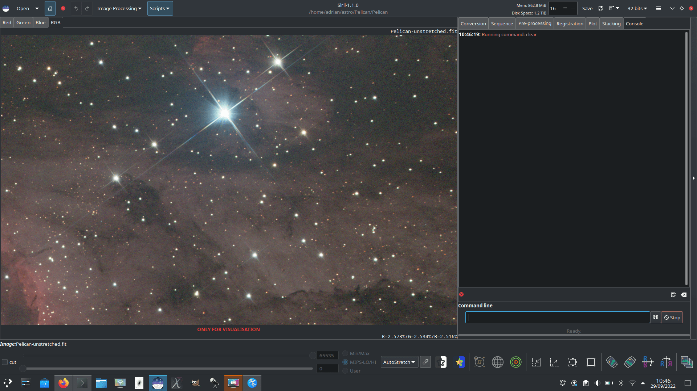
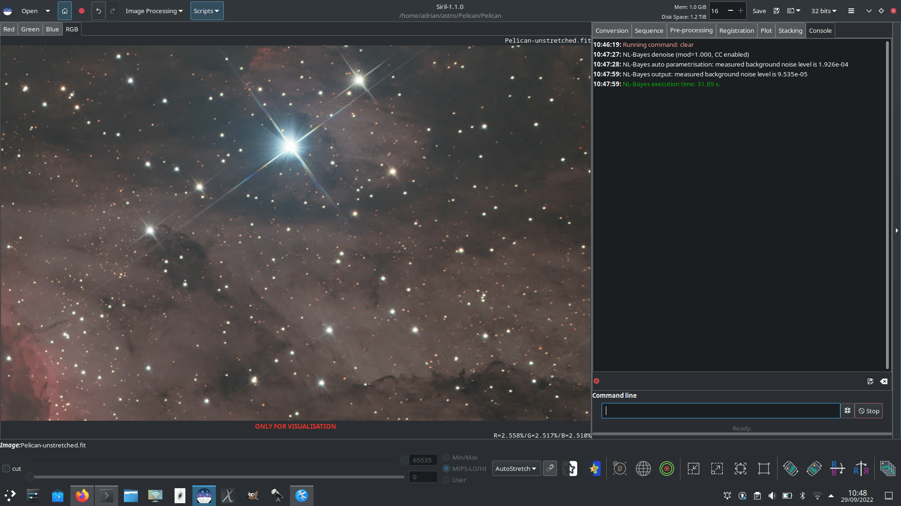
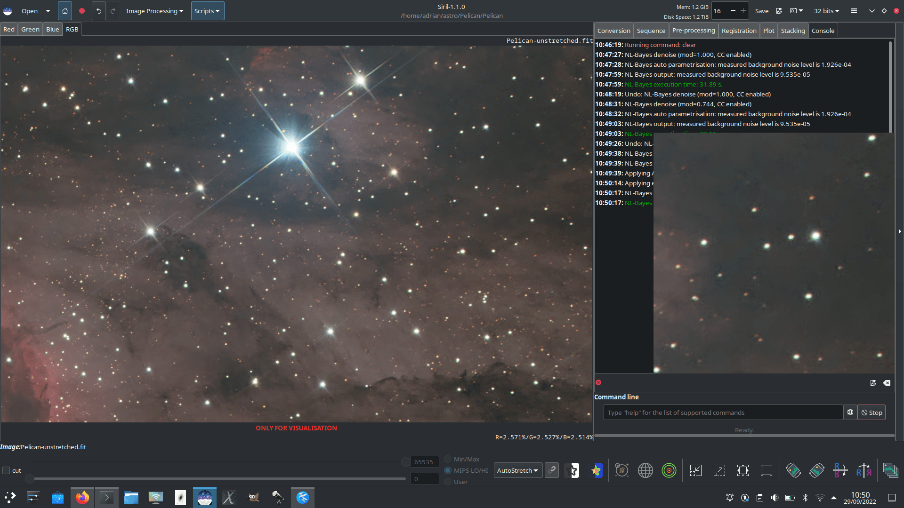

###############
Noise Reduction
###############

***********
Image Noise
***********

Images suffer from various types of noise:

#. Impulse noise

    * This type of noise (sometimes called “salt and pepper noise”) typically arises 
      from hot or cold pixels. It is usually dealt with by using sigma rejection 
      stacking, but sometimes you may need to deal with it if processing a single 
      unstacked image.

#. Additive White Gaussian Noise

    * This type of noise is typical of well-illuminated photographs: it arises
      from the thermal and electronic fluctuations of the acquisition device,
      and the noise level is independent of the signal. AWGN can be reduced at
      capture time by using cooled cameras, and it is reduced in stacking
      because stacking :math:`n` images increases the correlated signal by a
      factor of :math:`n` whereas the uncorrelated noise only increases by a
      factor of :math:`\sqrt{n}`. It is also the type of noise that most
      classical denoising algorithms are designed to remove.

#. Poisson Noise

    * When dealing with photon-starved images, the character of the noise
      ceases to be primarily Gaussian and the probabilistic nature of photon
      counting becomes significant or even dominant. This is modelled by a
      Poisson distribution and this type of noise is signal dependent.

************************
Noise Reduction in Siril
************************

Siril provides well-studied state-of-the-art classical denoising
algorithms. The criteria for choosing algorithms were:

* The algorithm should be analysed in peer reviewed academic journals, with a
  description of the algorithm and an objective quantitative comparison of
  its performance.
* The authors should have made available a F/OSS
  implementation. This is important to avoid IP issues and, where the
  reference implementations have been used directly, to ensure licence
  compatibility.
* The algorithms should perform at a reasonable speed.
* Finally, the implementation of the algorithm must be capable of
  processing 32 bit floating point pixel data.

Neural network denoising technology was investigated, but discounted at
the current time on the grounds of development complexity. The denoising
performance of neural networks can typically beat classical approaches
by up to a dB peak signal-to-noise ratio, but performance is highly
dependent on the neural network being trained on data representative of
the real live data.

.. figure:: ../_images/denoising/denoise-dialog.png
   :alt: denoise-dialog
   :class: with-shadow
   :width: 100%

   Noise Reduction dialog

*************************
Algorithms: Impulse Noise
*************************

Siril primarily removes impulse noise through sigma rejection stacking.
If you use this stacking method, you shouldn’t have any issues with
impulse noise. However if you are working on a single exposure you may
well find impulse noise in your image. This should be dealt with using
Siril’s **Cosmetic Correction** function before any other noise
reduction is used, as the presence of impulse noise can skew AWGN
denoising algorithms and create artefacts. It works in a similar way to
sigma rejection, but on neighbouring pixels. Any pixel whose intensity
is more than *n* standard deviations away from its neighbours will be
rejected and replaced by a value based on the median of the neighbours.
In the Denoising tool Cosmetic Correction is active by default and will
take place before any additional denoising steps. (Even if impulse noise
removal has already been carried out, leaving the setting on does no
harm.) Alternatively, Cosmetic correction can be applied manually using
the :guilabel:`Cosmetic Correction` tool in the :guilabel:`Image Processing` 
menu.

*****************************************
Algorithms: Additive White Gaussian Noise
*****************************************

The main AWGN noise reduction algorithm used in Siril is Non-Local
Bayesian (NL-Bayes) denoising [Lebrun2013]_.

* Non-local denoising algorithms represented a major improvement over previous 
  pixel-centred linear filters. NL-Bayes is an improved version of the earlier 
  non-local denoising algorithms and offers one of the best classical AWGN 
  denoising algorithms. It is marginally better than the modern “benchmark”
  algorithm Block Matching and 3D tranform (BM3D) noise reduction and much
  faster to execute.
       
* The key parameter required to optimise the performance of AWGN algorithms is 
  sigma, the standard deviation of the noise. Siril measures the noise level 
  directly from the image data and passes this to the NL-Bayes algorithm, 
  therefore in the Siril denoising tool there are no configurable inputs to 
  NL-Bayes.

Siril complements NL-Bayes with a number of other noise reduction
algorithms:

* Data-Adaptive Dual Domain Denoising (DA3D) [Pierazzo2017]_

    * This takes the output of NL-Bayes and uses it as a guide image.
      This guide image is used to reprocess the original image by
      performing frequency domain shrinkage on shape and data-adaptive
      patches. It slightly improves the performance of NL-Bayes at some
      additional computational cost. The shape and data-adaptive patches
      are dynamically selected, thus concentrating the computations on
      the areas with greatest image detail. It can also help to reduce
      staircase artefacts present in the guide image.
       
    * In the Siril denoising tool, DA3D is a simple toggle with no
      optional settings.

* Strengthen, Operate, Subtract iteration (SOS) [Romano2015]_

    * SOS works by iterating the primary denoising algorithm several
      times. At each iteration the image is "strengthened" by mixing in
      a proportion of the original noisy image. The NL-Bayes algorithm
      runs on this strengthened image, after which the previous
      estimation is subtracted.
       
    * The image x at an iteration :math:`k+1` is given by
      :math:`x_{k+1}=f(y+x_k)-x_k` where :math:`y` is the noisy input
      image.
       
    * In the Siril denoising tool, SOS is a toggle with two parameters:
      the number of ``iterations`` can be set, and the proportion of the
      noisy image mixed in at each iteration (``rho``) can be set. Avoid
      setting ``rho`` too high as it can result in issues with SOS
      converging: the default values (``3 iterations`` and
      ``rho = 0.2``) are usually fine.

**********************************************
Algorithms: Poisson and Poisson-Gaussian Noise
**********************************************

* Anscombe Variance-Stabilising Transform [Mäkitalo2011]_, [Mäkitalo2012]_

    * Variance stabilising transforms are used for images with Poisson
      or Poisson-Gaussian noise to minimise the signal dependence of the
      noise and make it look more like AWGN, which NL-Bayes is good at
      removing, and then an inverse transform is applied on completion.
      The transform chosen for use in Siril is the Anscombe transform
      :math:`A: x\rightarrow 2\times \sqrt{\left(x+\frac{3}{8}\right)}`

    * As the transform is non-linear, use of the direct algebraic
      inverse results would bias the output. Siril therefore uses a
      closed-form approximation to the exact unbiased inverse, which is
      quick to calculate and produces a substantial improvement over
      other forms of inverse such as the asymptotic inverse.

    * In the Siril denoising tool, the Anscombe VST is a simple toggle
      with no optional settings.

Note that only one of the above mentioned complementary denoising
algorithms can be chosen.

The animation below shows what is possible using variance stabilisation
with a photon-starved image, in this case a single 5 minute red filter
sub of the Pelican nebula, shown with the :guilabel:`AutoStretch` screen
transfer function. Note the lack of blurring, bloating or loss of detail
around stars and the sharp edge of the nebula in the bottom left part of
the image compared with what might be obtained through more basic noise
reduction schemes. Once stretched more sympathetically and combined with
other channels this would greatly improve the quality achievable from
very limited data (though more data is always the better solution!)

.. figure:: ../_images/denoising/singlesub.gif
   :alt: single-sub
   :class: with-shadow
   :width: 100%

   Denoising a photon-starved image

**********
Modulation
**********

In Siril, modulation is a parameter between 0 and 1 mixing the original and
denoised images. A value of 1 keeps only the denoised image, a value of 0 does
not apply any denoising at all. Modulation  obviously reduces denoising
performance, but in some instances if denoising has left flat areas of the image
looking a little too smooth, you can use some modulation to restore the
appearance of microtexture in these regions.

***************************
When to run Noise Reduction
***************************

The noise reduction algorithms are designed to remove AWGN and should therefore
perform best on unstretched images: if white noise has a non-linear stretch applied,
its characteristics change and it is no longer white. Performing noise reduction on
stretched images can still be done and will result in an improvement, but potentially
will not be as effective as if applied at the linear stage.

*************************
Noise Reduction Interface
*************************

The Siril Noise Reduction tool can be accessed in two ways: via the GUI,
or via the command interface. The GUI is shown below. Note: the SOS
advanced options are hidden if SOS is not selected.

.. figure:: ../_images/denoising/dialog.png
   :alt: dialog
   :class: with-shadow

   Siril Noise Reduction GUI

Noise reduction can also be applied using Siril commands, either in the
console or in scripts. The format is:

.. admonition:: Siril command line
   :class: sirilcommand
  
   .. include:: ../commands/denoise_use.rst

   .. include:: ../commands/denoise.rst

**********
Comparison
**********

The images below provide a simplistic comparison of the different
algorithms. Note that only one image is used: in practice, different
algorithms will be better suited for use on different images. All the
images can be clicked on to view at 100% zoom.

Original noisy image
====================

   Noisy image

Denoised with NL-Bayes only
===========================

   Denoised with NL-Bayes only

Denoised with NL-Bayes only, with 75% modulation to restore some microtexture
=============================================================================

.. figure:: ../_images/denoising/075modulation.png
   :alt: modulation
   :class: with-shadow
   :width: 100%

   Use of modulation

Denoised with NL-Bayes using the Anscombe transform
===================================================

   Denoised with NL-Bayes, variance stabilised with Anscombe transform. A 200% 
   uninterpolated zoom is shown to the right.

Denoised with DA3D using a NL-Bayes guide image
===============================================

.. figure:: ../_images/denoising/denoise-with-da3d.png
   :alt: da3d
   :class: with-shadow
   :width: 100%

   Denoised with DA3D, guide image prepared using NL-Bayes. A 200% 
   uninterpolated zoom is shown to the right.

Denoised with NL-Bayes and SOS
==============================

.. figure:: ../_images/denoising/denoise-with-sos.png
   :alt: sos
   :class: with-shadow
   :width: 100%

   Denoised with NL-Bayes and SOS iterations. A 200% uninterpolated zoom is 
   shown to the right.

***********
Limitations
***********

The main limitation is that the algorithms work best when the noise is
Gaussian in character (or can be made approximately Gaussian using the
VST). There are some reasons why this might not be true:

* If the image has already been heavily processed, for example with 
  deconvolution or wavelet sharpening, the character of the noise will not 
  generally be Gaussian any more. If both noise reduction and deconvolution 
  form part of your workflow, noise reduction should be done first.

* OSC images may
  denoise less well than mono or composited colour images. A small reduction of
  luminance AWGN is achieved but as a result of the deBayering process the
  character of the noise is changed so that it is no longer well modelled as AWGN,
  and is not removed very effectively. Additionally, for both OSC and composited mono
  colour images, chrominance noise tends not to be well modelled as AWGN and
  requires different treatment. At present chrominance noise is best tackled in
  general purpose image manipulation software such as `The GIMP <https://www.gimp.org>`__.

**********
References
**********

.. [Lebrun2013] Lebrun, M., Buades, A., & Morel, J. M. (2013) *Implementation
   of the “Non-Local Bayes” (NL-Bayes) Image Denoising Algorithm.*
   Image Processing On Line, 3 , pp. 1–42. 
   https://doi.org/10.5201/ipol.2013.16

.. [Pierazzo2017] Pierazzo, N., & Facciolo, G. (2017). *Data adaptive dual 
   domain denoising: a method to boost state of the art denoising algorithms.* 
   Image Processing On Line, 7, 93-114.
   https://doi.org/10.5201/ipol.2017.203

.. [Mäkitalo2011] Mäkitalo, M., & Foi, A. (2012, March). *Poisson-gaussian 
   denoising using the exact unbiased inverse of the generalized anscombe 
   transformation.* In 2012 IEEE International Conference on Acoustics, Speech 
   and Signal Processing (ICASSP) (pp. 1081-1084). IEEE.
   https://doi.org/10.1109/ICASSP.2012.6288074

.. [Mäkitalo2012] Makitalo, M., & Foi, A. (2011). *A closed-form approximation 
   of the exact unbiased inverse of the Anscombe variance-stabilizing 
   transformation.* IEEE transactions on image processing, 20(9), 2697-2698.
   https://doi.org/10.1109/TIP.2011.2121085
   
.. [Romano2015] Romano, Y., & Elad, M. (2015). *Boosting of image denoising 
   algorithms.* SIAM Journal on Imaging Sciences, 8(2), 1187-1219.
   https://doi.org/10.1137/140990978
