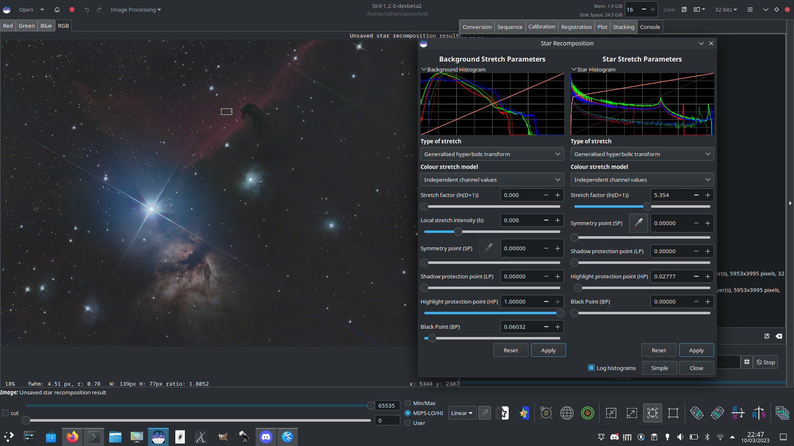

Star Recomposition
==================

Star Recomposition is a GUI tool to aid in combining starless and star mask images.
It doesn't provide any unique image manipulation that can't be done in other ways,
for example using PixelMath and the Generalized Hyperbolic Stretch tool, but it
does provide a real-time preview of the combination of two separate images with
different stretches applied to each.

There is no command-line equivalent for this tool as it is purely graphical in
nature, however starless and star mask images could be combined using the PixelMath
`pm` command and GHT-related commands (`ght`, `invght`, `modasinh`, `invmodasinh`
and `linstretch`).

The tool is found in the Image Processing menu, in the Star Processing sub-menu.

The dialog is divided into two columns, one for each of the input images.

.. figure:: ../../_images/processing/stars/starrecomp_dialog.png
   :alt: star recomposition dialog
   :class: with-shadow

   Star Recomposition dialog box.

Each input image is loaded using the respective file chooser. Each column has
a stretch histogram preview, which may be minimized to aid use on small displays,
a set of GHS stretch controls, and Reset and Apply buttons.

The histogram mode can be changed between linear and logarithmic using the
toggle at the bottom of the dialog. This dialog obeys the Siril-wide
preference for linear or logarithmic histograms that can be set in the
Preferences window.

.. tip::
   Star Recomposition does not obey the FITS 16-bit preference as there could
   be an adverse effect on performance in some cases (the calculations must
   be done using floating point maths anyway). So if you really want a 16-bit
   result to be created from 32-bit input images then you will need to use the
   :guilabel:`precision switch`.

Simple Mode
***********

The dialog has two views, which determines what controls are shown. It opens
in Simple mode, which shows only the most useful controls for a typical
starless / starmask combination.

* The stretch type for the starless image is set to Generalized Hyperbolic
  stretch and the Stretch Factor, Local stretch intensity, Symmetry Point
  and Black Point controls are shown. As well as using the SP control, the
  Symmetry Point can be set using the eyedropper tool to select the average
  pixel value of a selection from the image.

  *Note that the eyedropper tool
  is disabled when there is an unapplied BP shift: because of the process of
  applying the hyperbolic stretch and then the BP shift, the behaviour of the
  tool becomes non-intuitive when a non-zero BP parameter is set. To resolve
  this, simply apply the BP shift and the eyedropper will become available
  again for your next hyperbolic stretch*.

* The stretch type for the star mask image is set to Modified Arcsinh stretch
  and the Stretch Factor and Highlight Protection controls are shown.

* The human-weighted luminance color model is used for both sets of stretches:
  this does a better job of preserving colors in the unstretched image.

Details of all the stretch controls, both those shown in Simple mode as well
as those shown in Advanced mode, can be found on the Generalized Hyperbolic
Stretch documentation page.

The BP control works in a slightly different way to the BP control in
the standalone GHS linear (black point adjust) stretch. In this tool the Black
Point adjustment is applied *after* the hyperbolic stretch, whereas in the
standalone tool it is a separate stretch applied by itself. When trying to
optimize the combination of independent stretches to the two input images,
this was found to be the most workable approach. It does mean that the amount
of black point shift required in this tool is different to the amount
required in the GHS tool, and that the Black Point cannot be set by clicking
on the histogram.

Each stretch is independent. The stretch settings for the starless side can be
applied using the left-hand Apply button: this stretches the starless image
according to the current stretch settings and then resets the stretch settings
so that further stretches can be applied in an iterative manner. Similarly, the
stretch settings for the star mask can be applied using the right-hand Apply
button. Either set of stretch settings can be reset to the defaults using its
respective Reset button.

The dialog can be toggled between Simple and Advanced mode using the button at
the bottom.

Advanced Mode
*************

In Advanced mode the full range of GHS stretch controls are available including
Stretch Type, Colour stretch model and Shadow protection point
for both input images. This allows greater customization of the two stretches
if required. If the user interface is put back to Simple mode, any changes
made using the advanced controls remain in effect, only the controls are
hidden.

.. note::
   It is not possible to stretch the saturation channels in this tool. The tool
   is already quite memory-hungry and CPU intensive: doubling the memory requirement
   by adding a HSL copy of each working image is considered excessive. Saturation
   can easily be stretched separately after the combination is complete.

   Using Star Recomposition combine a starless image and star mask of the Alnitak
   region
