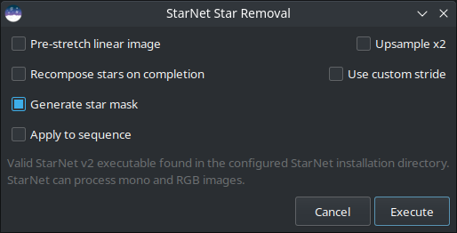

StarNet Star Removal
======================

.. warning::
   The Starnet interface built into Siril itself is now deprecated. StarNet 2.5
   has been released and is supported by means of a Python script which is
   available in the scripts repository. The legacy C interface will **not** support
   Starnet 2.5 but will remain available in Siril 1.4.x for users of older
   versions of Starnet.

   **In Siril 1.6 the legacy C interface will be removed**
   so all users will need to upgrade to Starnet 2.5 and use the python script.
   The script does provide CLI args so where scripts use the Siril :kbd:`starnet`
   command they will need to adapt to using ``pyscript StarNet.py`` instead.

StarNet is a software developed by Nikita Misiura. Its
`first version <https://github.com/nekitmm/starnet>`_ was released under a free 
and opensource license. Unfortunately, version 2 became proprietary and the 
sources are since closed. The version 2 is available free of charge from 
`there <https://www.starnetastro.com/download>`_. Make sure you download the 
**Command Line Tool** version. Siril can interface with any version of the
StarNet CLI tool, including the new experimental Torch-based version that has
initially been released for M1- and M2- based Apple Macs.

.. warning::
   If you are wondering **why StarNet doesn’t launch**, please run it outside 
   Siril first. It’s not Siril’s fault if it’s not supported by your computer or 
   badly installed for some reason. If your processor does not support the 
   vectorization instructions required by StarNet, there is no way to bypass 
   that. The error message will be obtained by executing StarNet alone.

.. tip::
   On **MacOS**, for Siril to detect and use StarNet correctly, it is necessary
   to fix some permissions and security issues first. Start by opening the 
   Terminal application from the Utilities folder within Applications. In 
   Terminal, you need to change your working directory from your home directory
   to the StarNetCLI installation directory. To do this type in ``cd`` followed
   by a :kbd:`space` and then drag the StarNetCLI folder into the terminal 
   window to copy its path. Press :kbd:`enter`. Then type in the following four 
   commands, pressing :kbd:`enter` after each one:
   
   .. code-block:: bash
   
      xattr -r -d com.apple.quarantine libtensorflow_framework.2.dylib
      xattr -r -d com.apple.quarantine starnet++
      chmod +x starnet++ 
      chmod +x run_starnet.sh

   Then, at the first use with Siril, the execution of StarNet may fail with
   a warning about libtensorflow. Cancel out of this warning. Open System 
   Preferences and under Privacy and Security click the :guilabel:`Allow anyways`
   button for libtensorflow. After this, StarNet should execute properly in Siril.
   
.. tip::
   On **MacOS**, again, there is a new Starnet executable optimized for the Apple 
   Silicon chip that has been released on the site: `<https://www.starnetastro.com/experimental/>`_.
   This new version is much faster than previous version because it uses the 
   new MPS accelerated PyTorch (`<https://developer.apple.com/metal/pytorch/>`_).
   Also, this version contains signed binaries, follow the installation 
   instructions in the README.txt

However, it is still possible for Siril to run external binaries and this is 
what we decided to implement starting with Siril 1.2.0. For the settings,
please refer to the preference :ref:`page <starnet_pref>`. It explains how to
tell Siril where StarNet is located.

.. warning::
   This is the location of the command line version of StarNet that need to
   be given, not the GUI one.

Note that StarNet requires its input in the form of TIFF images, therefore if
Siril is compiled without libtiff support then the StarNet integration will
not be available.

The primary purpose of StarNet is to remove all the stars from the images in
order to apply a different process between the stars and the rest of the image.
This usually helps to control star bloat during the different stretches, but it
is also very useful for creating images of comets where the comet tracking
rate can be significantly different to the distant stars.

   StarNet dialog box.
   
The tool is very easy to use and only five options are available:

* **Pre-stretch linear image**: If selected, an optimised Midtone Transfer 
  Function (MTF) stretch is applied to the image before running StarNet, and
  the inverse stretch is applied on completion. This is necessary for using 
  StarNet at the linear stage of processing.

* **Recompose stars on completion**: If selected, on completion of the star 
  removal process the star recomposition tool will open, providing an interface
  for independently stretching and blending the background and the stars if 
  star reduction, rather than total removal, is desired. This option has no
  effect when processing a sequence.

* **Generate star mask**: This will generate a star mask and saved it in the
  working directory. The star mask is calculated as the difference between the 
  original image and the starless image. The default is to produce a star mask.

* **Upsample x2**: This option will up-sample the image by a factor of 2 
  before running StarNet. This improves performance on very tight stars but
  quadruples processing time and may impair performance on very large stars. 
  The image is rescaled to the original size on completion.

* **Use custom stride**: A custom value may be entered for the StarNet
  stride parameter. The default value is 256 and the StarNet developer
  recommends not to change this.

The StarNet process can easily be applied to a sequence. The togglebutton
:guilabel:`Apply to sequence` selects whether the process will
apply to a single image or to a sequence. Where the process is applied to a
sequence, a new sequence will be created containing the starless images and, if
star mask generation is selected, a second sequence will be created containing
the corresponding star mask images.
  
More information about StarNet can be found on the `original website <https://www.starnetastro.com/tips-tricks/>`_.

A click on :guilabel:`Execute` will run the process. It can be slow, depending of
your machine performance. However, Siril shows a progressbar to follow the
processing. As with other Siril processes, if processing a sequence the progressbar
will only update after completion of each image in the sequence, and will show
the overall progress through the sequence.

Commands
********

.. admonition:: Siril command line
   :class: sirilcommand

   .. include:: ../../commands/starnet_use.rst

   .. include:: ../../commands/starnet.rst

.. admonition:: Siril command line
   :class: sirilcommand

   .. include:: ../../commands/seqstarnet_use.rst

   .. include:: ../../commands/seqstarnet.rst

