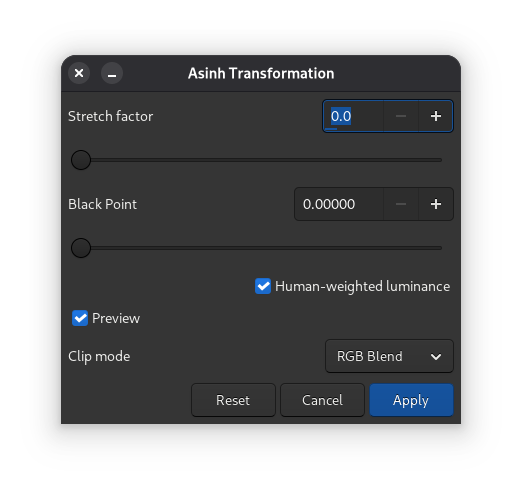
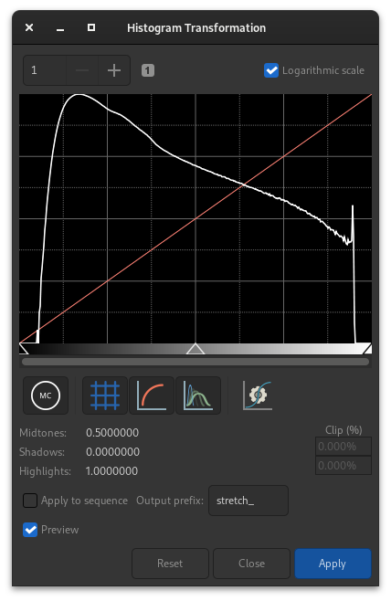
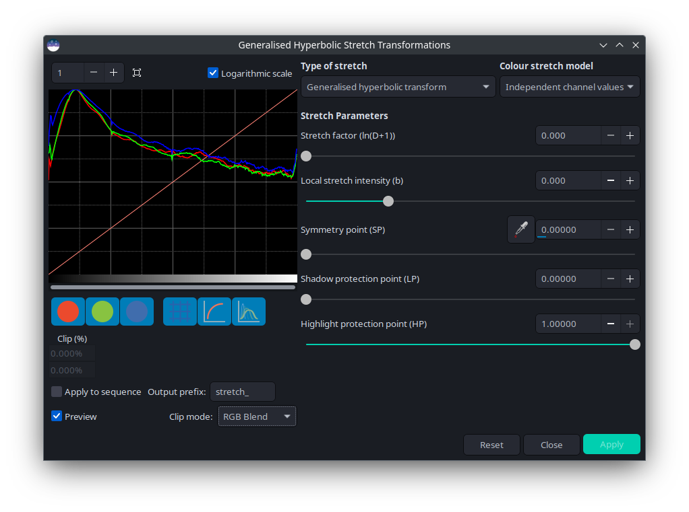
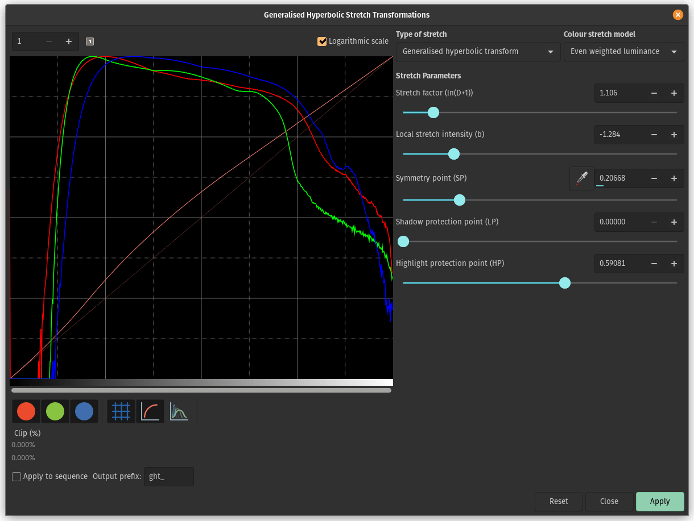

Image stretching
================

Image are stored as pixel values that come from the camera following a
quasi-linear law, meaning that for areas of the sky that show no visible
feature, the pixel value will be close to zero, but for bright objects like
stars it will be close to a maximum value depending on exposure and gain. In
between, if a nebula has a surface magnitude half of a star, it will have pixel
values half of those of the star and so on. This is what we call the linear
pixel mode.

The human eye doesn't quite see photons like that. It amplifies dark areas,
so that an object maybe a tenth as bright as another would look half as bright.
For astronomy images, we usually display images with a similar pixel value
scaling (see display modes from the GUI).

But it is only a display trick, using a screen transfer function, to render
the pixel values of the untouched image to better looking images.

Image stretching is about doing something similar but by modifying the pixel
values of images instead of just altering their rendering. Siril has three main
tools to achieve this.

.. toctree::
   :hidden:

Asinh transformation
--------------------
The asinh, or inverse hyperbolic sine, transformation will modify image pixel
values in a way similar to what can be seen with the asinh display pixel
scaling function, which is parametrized by the low and high values cut-off
cursors. Here the parameters are the stretch factor and the black point value.

   Dialog box of Asinh Transformation

For monochrome images, pixel values are modified using the following function:

.. math::

   \text{pixel} = \frac{(\text{original} - \text{blackpoint})\times\text{asinh}(\text{original}\times\text{stretch})}{\text{original}\times\text{asinh}(\text{stretch})}

For color images, the function becomes:

.. math::

   \text{pixel} = \frac{(\text{original} - \text{blackpoint})\times\text{asinh}(\text{rgb}\_\text{original}\times\text{stretch})}{\text{rgb}\_\text{original}\times\text{asinh}(\text{stretch})}

where rgb_original is computed using the pixel values of the three channels.

A clipping mode can also be set.

.. _clipping_modes:

.. admonition:: Theory
   :class: siriltheory
   
   As rgb_original is an average of the 3 channels, one or two channel values
   will be greater than rgb_original and can therefore clip. This can cause color
   artefacts when bright, strongly-colored regions are stretched. In order to
   avoid this problem the RGB blend clipping algorithm was developed by the
   authors of the original GHSastro tool: the same algorithms are available in
   the Siril implementation and this is the default clipping mode for stretches
   that require handling of clipping. The :math:`(r, g, b)` values are stretched first
   based on the luminance value rgb_original to give :math:`(r', g', b')`. Then
   the original :math:`(r, g, b)` values are independently stretched to give
   :math:`(r'', g'', b'')`. Finally the largest value of :math:`k` is identified
   such that

   :math:`k \times r' + ( 1 - k ) \times r'' ≤ 1`;

   :math:`k \times g' + ( 1 - k ) \times g'' ≤ 1`;

   and

   :math:`k \times b' + ( 1 - k ) \times b'' ≤ 1`

   Then the transformed values are calculated as

   :math:`( k \times r' + ( 1 - k ) \times r'', k \times g' + ( 1 - k ) \times g'', k \times b' + ( 1 - k ) \times b'')`

   This RGB blend clipping algorithm is also available for the Generalised Hyperbolic
   Stretch transforms described below.

   Other choices of clipping algorithm are available:

   * *Clip* - this clipping mode just allows any colour components that clip to
     clip, but restricts them to values in the range 0.0 to 1.0. This may suffer
     from coloured artefacts such as fringes around nearly-saturated stars, but
     it is extremely quick to calculate.

   * *Rescale* - this clipping mode checks the R, G and B components of each
     pixel and if any are > 1.0 it rescales the pixel so that no components are
     clipped. This method is prone to artefacts and is mainly included for feature
     equivalence with the GHSastro plugin. It is quick to compute.

   * *Global Rescale* - this clipping mode behaves similarly to *Rescale* except
     that the scaling is computed globally instead of per-pixel. This avoids
     the kind of artefacts that Rescale can produce, but has a bigger impact on
     overall image brightness. This is faster than *RGB blending* to compute
     but slower than *Clip* or *Rescale*.

When the Use Human-weighted Luminance option is not ticked, rgb_original is the
mean of the three pixel values; when it is set, weighting changes to 0.2126
for the red value, 0.7152 for the green value and 0.0722 for the blue value,
which gets results closer to human perceptual color balance.

.. admonition:: Siril command line
   :class: sirilcommand
   
   .. include:: ../commands/asinh_use.rst

   .. include:: ../commands/asinh.rst

Midtone Transfer Function Transformation (MTF)
----------------------------------------------
MTF is one of the most powerful tools for stretching the image. It can be 
easily automated and that's why the auto-stretched view uses it.

   Dialog box of the Histogram Transformation

The tool is presented in the form of a histogram with 3 sliders (in the form 
of a triangle placed underneath) that we must move to transform the image. 
The triangle on the left represents the shadow signal, the one on the right 
the highlights and finally, the one in the middle the midtone balance 
parameter. The values of these sliders are displayed below the histogram, on
the left, and can be changed directly by hand. Opposite is the percentage of 
pixels that are clipped by the transformation: it is important not to clip too
many pixels. If only the midtones parameter is changed, then no pixel can be 
clipped.

.. admonition:: Theory
   :class: siriltheory

   The new pixel values are then computed with this function:

   .. math::
      :label: MTF

      \text{MTF}(x_p) = \frac{(m - 1)x_p}{(2m - 1)x_p - m}. \\
  
   * For :math:`x_p=0`, :math:`\text{MTF} = 0`,
   * for :math:`x_p=m`, :math:`\text{MTF} = 0.5`,
   * for :math:`x_p=1`, :math:`\text{MTF} = 1`,

   where :math:`x_p` is the pixel value defined as follow

   .. math::
      :label: x_p
   
      x_p=\frac{\text{original}-\text{shadows}}{\text{highlights}-\text{shadows}}.
   
.. note::
   It is generally not recommended to change the value of the highlights, 
   otherwise they will become saturated and information will be lost.

.. |auto-stretch-button| image:: ../_images/icons/mtf.svg
   
The toolbar contains many buttons that affect the visualization of the 
histogram. You can choose to display the input histogram, the output 
histogram, the transfer curve and the grid. The button |auto-stretch-button| 
allows you to apply the same transformation as the autostretch algorithm. It 
is rarely advisable to use this button as is. Adjustments are usually 
necessary to avoid losing information.

.. tip:: When the |auto-stretch-button| button is pressed, the sliders and
   lo, mid and hi entries will become temporarily inactive. You have to apply
   the autostretch with the :guilabel:`Apply` button and the controls will
   reactivate. You can then apply adjustments as a second follow-up stretch.
   This behaviour avoids problems where the monitor ICC profile is different
   to the image ICC profile.

At the top of the histogram it is also
possible to choose to display the histogram in logarithmic view, as in the 
illustration. This behavior can be made default as explained
:ref:`here <preferences/preferences_gui:User Interface>`. Finally a zoom in X 
is available. This is very useful when all the signal is concentrated on 
the left of the histogram.

.. tip::
   If a ROI is set, the MTF histogram preview will not update to show the impact
   of the stretch on the ROI. This is because that behaviour could be misleading:
   if the ROI is not typical of the image overall, adjusting the ROI histogram
   to a suitable level would result in a badly adjusted histogram for the
   overall image and potentially a burned-out or excessively dark look to the
   result. When in ROI mode the stretch parameters should be adjusted by eye.
   If it is desired to check the histogram for the stretch as applied to the
   image as a whole, the ROI should be cleared.

.. admonition:: Siril command line
   :class: sirilcommand
   
   .. include:: ../commands/mtf_use.rst

   .. include:: ../commands/mtf.rst
   
.. note::
   ``mtf`` is also a function that can be used in the :ref:`PixelMath <processing/pixelmath:Pixel Math>` tool.
   
.. admonition:: Siril command line
   :class: sirilcommand
   
   .. include:: ../commands/autostretch_use.rst

   .. include:: ../commands/autostretch.rst

.. rubric:: Applying transformation to the sequence

This transformation can easily be applied to a sequence. You just have to 
define the transformation on the loaded image (with a sequence already loaded),
then check the :guilabel:`Apply to sequence` button and define the output prefix of 
the new sequence (``stretch_`` by default), or use the following command:

.. admonition:: Siril command line
   :class: sirilcommand

   .. include:: ../commands/seqmtf_use.rst

   .. include:: ../commands/seqmtf.rst

Generalised Hyperbolic Stretch transformations (GHS)
----------------------------------------------------

This is the most capable and modern tool of Siril, also the most complex to
learn. A very detailed tutorial for this tool in Siril was written by the
authors of this algorithm: https://siril.org/tutorials/ghs. Here, we
will just summarize here the basic operation of this tool.

   Dialog box of the Generalized Hyperbolic Stretch

Simply put, the GHS is able to improve the contrast of a range of brightness
levels in an image. For example, if one wanted to better view the details in
the medium to high brightness part of a nebula (which is in general very faint
in an astronomy image), it would be possible to only select this range for
stretching. It is very good at improving the contrast of main objects without
making stars too big. The tool is very much based on iterative use, so
stretching all the different ranges of brightnses in the image one after the
other, by small touches.

To achieve this, the tool relies heavily on histogram display and interaction,
for each color channel. The transformation function, shaped like a hyperbole or
an 'S', can be altered by moving its center (the **SP** - symmetry point
parameter), by flattening either of its ends (with **shadow** and **highlight
protections**), and of course its twist (stretch **D** and local stretch **b**
factors). Manipulating these parameters on a small (for speed) image with an
**SP** value of 0.5 will help you understanding their effect.

There are two main operations to do on each iteration: selecting the range of
lights to modify, and actually modifying it. Selecting the range is quite easy,
it's a matter of finding a representative value (**SP**) and defining the width of
the range (**b**). Setting **SP** can be done in three ways:

* selecting an area of similar brightness in the image and clicking on the
  picker button
* clicking on the histogram itself with a single left click (it is possible to
  zoom in the histogram using the + button at the top left)
* using the cursor or its associated plus and minus buttons or direct value.

The width of the range depends on the local stretch. A high value of **b** will
make a small range, and increase contrast over a small range of brightnesses in
the image.

Modifying the histogram once the location of the change has been set is a more
complex operation. One goal given by the algorithm's authors is to make the
logarithmic view of the histogram (enabled by checking the box) as close as
possible to a decreasing line. To do this, bumps need to be carved out and
valleys to be filled. Here is a quick guide of values to use depending on what
needs to be achieved:

* **initial stretch from linear:** set **SP** slightly to the left of the main
  peak, moderate **b** value from 6 and up, increase **D** slightly only to
  start to see the main object. Do not stretch too much at this point like an
  autostretch would do, otherwise the stars would grow too big (`main tutorial
  section for this
  <https://siril.org/tutorials/ghs/#performing-initial-stretches-using-ghs>`_).

* **improving contrast of a range, or filling a valley:** set **SP** to the
  centre of the valley in the histogram, set **b** as high as how narrow the
  range or valley is, decrease **HP** to preserve stars, increase **D** slowly
  until the improvement appears.

* **decreasing contrast of a range, or flattening a peak:** decreasing a peak
  is not easy to do but will happen as a side effect of valleys being filled.
  For example, creating a peak, or filling a valley, will decrease what is on
  the left of **SP**. Another possibility is to use the inverse transformation,
  from the *Type of stretch* combo box, and a high **LP** value, and **HP** at
  1.

* **move curve to the left, making the image darker:** often if we stretched
  the entire histogram, the peak will move to the right, making the background
  too bright. There is a simple way to just move everything to the left, select
  in the *Type of stretch* combo box the last entry, **Linear stretch (BP
  shift)**. There's only one cursor to move now, controlling how much it will
  shift.

.. tip::
   If a ROI is set, the GHT histogram preview will not update to show the impact
   of the stretch on the ROI. This is because that behaviour could be misleading:
   if the ROI is not typical of the image overall, adjusting the ROI histogram
   to a suitable level would result in a badly adjusted histogram for the
   overall image and potentially a burned-out or excessively dark look to the
   result. When in ROI mode the stretch parameters should be adjusted by eye.
   If it is desired to check the histogram for the stretch as applied to the
   image as a whole, the ROI should be cleared.

Some operations are also common for **color images**, where we often want to
have a similar shape of curve for the three channels, working on each channel
independently by unselecting them with the three colored circles below the
histogram view:

   The Generalized Hyperbolic Stretch with a color image

* **moving the peak to the right:** a simple strech with a **SP** value left of
  the peak will do that in general, so this should be done as part of a
  stretch.
* **spreading a peak:** to stretch a channel a bit more and it give it more
  importance in the final result, without changing the location of the peak too
  much, set **SP** near the peak or slightly to its right, set **b** depending
  on how the contribution is expected throughout the channel, between a
  negative value if the impact shall be felt up to the stars levels (to change
  their color) and a high value if this is only for a nebula, increase **D** to
  obtain the target width of the peak, and
  then offset the peak to the left by decreasing **HP**.
* **moving all channels together:** an alternative luminance mapping stretch
  exists, see the *Color stretch model* combo box at the top right of the GHS
  window, using either luminance stretch values will stretch the luminance and
  reapply colors on it instead of stretching directly the three channels. The
  luminance modes can be better at preserving colours in the image. These modes
  use the same RGB blend clipping mode described above to prevent color channel
  clipping artefacts.
* **remapping image saturation:** the GHS transforms can be applied to the image
  saturation channel by selecting the Saturation option from the *Color stretch
  model* combo box. When this mode is selected the pre- and post- stretch
  saturation histograms will be shown in yellow. All the GHS options are available
  and this mode can provide highly targeted adjustment of the image saturation
  channel. A simple method of increasing the saturation in relatively
  unsaturated regions while preventing oversaturation is to use an **Inverse
  generalised hyperbolic transform** stretch with **SP** set to around 0.5, and
  **HP** brought down low enough to flatten the upper end of the saturation
  histogram.

In order to control partially-clipped highlights, the GHS tool makes available the
same range of clipping modes as the asinh stretch. Details can be found :ref:`here <clipping_modes>`.

  .. figure:: ../_images/processing/GHS_sat.png
   :alt: Applying GHS to the saturation channel to create a 'Mineral Moon'
   :class: with-shadow
   :width: 100%

   The image above shows how applying the GHS tool to the saturation channel gives
   an easy way of strongly enhancing saturation in a low-saturation image while
   still retaining control of the upper end of the saturation histogram, here used
   to create a 'Mineral Moon' image highlighting the differing mineral composition
   of different regions of the lunar surface.

.. admonition:: Siril command line
   :class: sirilcommand

   .. include:: ../commands/ght_use.rst

   .. include:: ../commands/ght.rst
   
.. admonition:: Siril command line
   :class: sirilcommand

   .. include:: ../commands/invght_use.rst

   .. include:: ../commands/invght.rst
   
.. admonition:: Siril command line
   :class: sirilcommand

   .. include:: ../commands/modasinh_use.rst

   .. include:: ../commands/modasinh.rst

.. admonition:: Siril command line
   :class: sirilcommand

   .. include:: ../commands/invmodasinh_use.rst

   .. include:: ../commands/invmodasinh.rst

.. admonition:: Siril command line
   :class: sirilcommand

   .. include:: ../commands/linstretch_use.rst

   .. include:: ../commands/linstretch.rst

.. rubric:: Applying transformation to the sequence

This transformation can easily be applied to a sequence. You just have to
define the transformation on the loaded image (with a sequence already loaded),
then check the :guilabel:`Apply to sequence` button and define the output prefix of
the new sequence (``stretch_`` by default). All of the commands have a sequence
processing form too. Each sequence stretching command starts with `seq` and the
first argument must be the sequence name, but they are otherwise the same.

.. admonition:: Siril command line
   :class: sirilcommand

   .. include:: ../commands/seqght_use.rst

   .. include:: ../commands/seqght.rst
   
.. admonition:: Siril command line
   :class: sirilcommand

   .. include:: ../commands/seqinvght_use.rst

   .. include:: ../commands/seqinvght.rst
   
.. admonition:: Siril command line
   :class: sirilcommand

   .. include:: ../commands/seqmodasinh_use.rst

   .. include:: ../commands/seqmodasinh.rst
   
.. admonition:: Siril command line
   :class: sirilcommand

   .. include:: ../commands/seqinvmodasinh_use.rst

   .. include:: ../commands/seqinvmodasinh.rst

.. admonition:: Siril command line
   :class: sirilcommand

   .. include:: ../commands/seqlinstretch_use.rst

   .. include:: ../commands/seqlinstretch.rst

Curves Transformation
----------------------------------------------------
Curves Transformation is a highly versatile tool used to adjust the contrast and brightness
of an image by modifying the pixel values according to a custom-defined curve. This allows
for precise control over the image's stretch.

The curve is defined by a series of points, each of which can be moved to adjust the
curve. The curve is interpolated between these points, and the pixel values are transformed
based on it. This allows for a wide range of transformations to be applied to the
image, from simple linear stretches to complex non-linear adjustments.

.. figure:: ../_images/processing/curves_cubic_spline.png
  :alt: Curves on a color image
  :class: with-shadow

  Dialog box of the Curves Transformation

There are two interpolation algorithms available in the Curves Transformation dialog: linear
and cubic spline.

.. admonition:: Theory
   :class: siriltheory

    * Linear interpolation is a simple interpolation that connects the points with straight lines.
      For each pair of points, the slope of the line connecting the points is calculated:

      .. math::
         :label: curves_linear

         \text{slope} = \frac{y_2 - y_1}{x_2 - x_1}. \\

      The pixel values are then transformed by evaluating the line at the original pixel value:

    .. math::
       :label: curves_linear_transform

       \text{pixel} = \text{slope} \times (\text{original} - x_1) + y_1.

    * Cubic spline curves are more complex curves that are defined by a series of control
      points. For pixel value :math:`x` between two control points :math:`x_i` and :math:`x_{i+1}`,
      the curve is defined by the following equation:

    .. math::
       :label: curves_cubic_spline

       S_i(x) = a_i + b_i (x - x_i) + c_i (x - x_i)^2 + d_i (x - x_i)^3

    For :math:`x_i < x < x_{i+1}`, the coefficients :math:`a_i, b_i, c_i`, and  :math:`d_i` are calculated by
    solving a system of equations derived from the conditions of continuity and
    smoothness at each internal point. These conditions are:

    * The spline must be continuous at each internal point,
    * The first derivative of the spline must be continuous at each internal point,
    * The second derivative of the spline must be continuous at each internal point
    * Since Curves Transformation uses natural cubic splines, the second derivative at both endpoints is 0.

.. warning::
   Curves Transformation is only available as a GUI tool and cannot be used from the command line.

Curves Transformationcan display the histogram of the image in two modes: linear and logarithmic.
You can swap between these modes by clicking the :guilabel:`Logarithmic scale` checkbox at the top of the histogram.
Logarithmic scale is useful for images with a wide dynamic range, as it allows you to see the histogram in the shadows
and highlights more clearly.

.. tip::
   If a ROI is set, the histogram preview will not update to show the impact
   of the stretch on the ROI. This is because that behaviour could be misleading:
   if the ROI is not typical of the image overall, adjusting the ROI histogram
   to a suitable level would result in a badly adjusted histogram for the
   overall image and potentially a burned-out or excessively dark look to the
   result. When in ROI mode the stretch parameters should be adjusted by eye.
   If it is desired to check the histogram for the stretch as applied to the
   image as a whole, the ROI should be cleared.

Some common uses of the Curves Transformation tool include:

* **"S" curve:** This curve is used to increase the contrast of an image. By increasing the
  slope of the curve in the middle of the histogram, the contrast is increased.

    .. figure:: ../_images/processing/curves_s_curve.png
       :alt: s-curve example
       :class: with-shadow

       An example of an "S" curve

* **BP & WP adjustments:** The black point (BP) and white point (WP) of an image can be adjusted
  by moving the first and last control points of the curve. This allows for the shadows and
  highlights of the image to be adjusted independently.

    .. figure:: ../_images/processing/curves_BP_WP_adj.png
       :alt: BP & WP adjustments
       :class: with-shadow

       An example of adjusting the black point and white point of an image

* **Targeted adjustments:** By adding control points at specific locations in the histogram, targeted
  adjustments can be made to the image. For example, the shadows can be darkened without affecting
  other parts of the image.

    .. figure:: ../_images/processing/curves_targeted_adj.png
       :alt: Targeted adjustments
       :class: with-shadow

       An example of a targeted adjustment to an image

.. tip::
   The Curves Transformation tool is best used on an image that has already been stretched to
   some extent. This allows for more precise control over the image's contrast and brightness.

This transformation can easily be applied to a sequence. All you have to do is
define the transformation on the loaded image while a sequence is loaded
and check the :guilabel:`Apply to sequence` button. Similarly to other stretching
tools, you can define the output prefix of the new sequence (``curve_`` by default).
