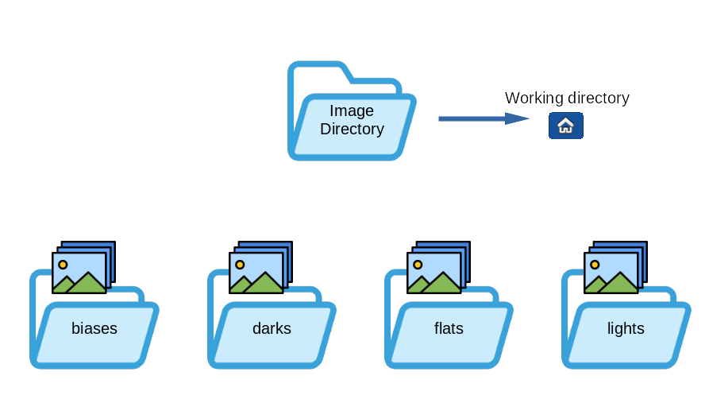

Siril Script Files
==================

Siril Script Files are the original format for scripting Siril and remain a
simple and useful way of automating a fixed set of tasks.

Siril Scripts
*************
Siril scripts are a list of commands, either from the graphical user interface
or from the command line interface. In general, commands that modify a single
image work on the currently loaded image, so the use of the :ref:`load <load>`
command is required in scripts, and commands that work on a sequence of images
take the name of the sequence as argument. If files are not named in a way that
Siril detects as a sequence, the command :ref:`convert <convert>` will help.

.. tip::
   The :kbd:`Space` character is the delimiter between arguments. If you need
   to have spaces inside the arguments you can use the quote or double quote,
   just like in a shell.

Commands can be typed in the command line at the bottom of Siril's main window.
Another way is to put commands in a file and execute it as a script. To execute
the file from the GUI, add it to the configured script directories or from the
GUI, use the ``@`` token of the command line like so:

.. code-block:: text

   @file_name

Some commands (:ref:`calibrate <calibrate>`, :ref:`stack <stack>`, and all
save commands) can use file names containing variables coming from the FITS
header. The format of the expression is explained in details
:ref:`here <Pathparsing:Path parsing>` and can be tested using the
:ref:`parse <parse>` command.

Using scripts
*************
There are four ways to run a script:

* from the graphical user interface, using the ``@`` keyword on the command
  line, followed by the script name in the current working directory,
* from the graphical user interface, using the :guilabel:`Scripts` menu,

  .. figure:: ../_images/scripts/Scripts_menu.png
     :alt: script menu
     :class: with-shadow

* from the graphical user interface, using the :guilabel:`Script Editor`
  dialog which can be used to write, save and execute your own scripts or to
  open and edit an existing script file,

  .. figure:: ../_images/scripts/script_editor.png
     :alt: script editor dialog
     :class: with-shadow

* from the command line interface (:program:`siril-cli` executable), using
  argument ``-s`` followed by the script's path (see the man page for more
  info).

When a script is running, the user interface becomes non-interactive with the
exception of the Stop button.

Populating the list of scripts
******************************

By default, when Siril is installed, a number of scripts are automatically
installed. These built-in scripts, the official ones, are developed by the
development team and are guaranteed to work: they are meant to cover specific
use cases.

.. _adding-custom:

Adding custom scripts folders
-----------------------------

You can, of course, :ref:`write your own <writing-your-own>` and tell
Siril where to find them:

 * Click on the :guilabel:`Burger` icon then on :guilabel:`Preferences` (or hit
   :kbd:`Ctrl+P`).
 * Click on the :guilabel:`Scripts` section.
 * Copy to a new line the path to the location to store them (create a folder
   on your computer as required or point to an existing one).
 * Click on the :guilabel:`Refresh` icon just below.
 * Click on :guilabel:`Apply`.

You can have as many user-defined folders as you wish, just add them to the list.

If you have just added a new script in one of the folders and wish to refresh
the menu, type the command :ref:`reloadscripts <reloadscripts>` in the command line or open the
:menuselection:`Preferences --> Scripts` section and use the :guilabel:`Refresh`
icon. This scans all the folders of the list and find all the files with the
\*.ssf extension.

.. warning::
  It is strongly advised **not** to store your custom scripts within the same
  folder as Siril built-in scripts. On Windows, they may get wiped when
  installing a newer version or prevent correct uninstall. On MacOS, it will
  break the bundle and prevent using Siril altogether.

  Don't worry, as the list of scripts locations is stored in your configuration
  file, you should find them back when installing a newer version.

Adding Scripts from the git Repository
--------------------------------------
Siril supports a git repository at https://gitlab.com/free-astro/siril-scripts
This is set to auto update at startup by default, so you will always have access
to the latest scripts (auto update can be disabled in preferences). To add scripts
from the repository to the Scripts menu, pick the ones you want from the list
available in :menuselection:`Preferences --> Scripts` or via the
:menuselection:`Scripts -> Get Scripts` menu entry. See below for full details of
the git repository.

Run Script Files
----------------
Script files can also be run directly from the hard disk using the
:guilabel:`Run Script Files...` script menu entry. The filechooser shown by this
menu defaults to showing recently used scripts, but you can navigate to choose
scripts from anywhere accessible on the filesystem.

Troubleshooting
---------------

For different reasons, it is possible that the :guilabel:`Scripts` menu is empty.
This means that the scripts have not been found. If this is the case,
please use the following procedure.

* Click on the :guilabel:`Burger` icon then on :guilabel:`Preferences`.
* Click on the :guilabel:`Scripts` section.
* Delete all the lines in the field :guilabel:`Script Storage Directories`
  as shown in the illustration below.
* If you are using the scripts repository, deselect the :guilabel:`Fetch and update scripts...`
  check box, then reselect it and select the scripts you want to use.
* Click on :guilabel:`Apply`.
* Close and restart Siril.

.. figure:: ../_images/preferences/pref_9.png
   :alt: dialog
   :class: with-shadow
   :width: 100%

   Script page of preferences. The script are loaded from the paths listed in
   the :guilabel:`Script Storage Directories`.

Built-in scripts
****************

All built-in scripts must follow this file structure:

* **Mono_Preprocessing.ssf**: script for monochrome DSLR or Astro camera
  preprocessing, uses biases, flats and darks, registers and stacks the images.
  To use it: put your files (RAW or FITs) in the folders named ``lights``,
  ``darks``, ``flats`` and ``biases`` (in the Siril default working folder),
  then run the script.
* **OSC_Preprocessing.ssf**: same script as above but for One-Shot Color (OSC)
  DSLR or Astro camera. To use it: put your files (RAW or FITS) in the folders
  named ``lights``, ``darks``, ``flats`` and ``biases`` (in the Siril default
  working folder), then run the script.
* **OSC_Preprocessing_BayerDrizzle.ssf**: same script as above but using Bayer
  Drizzle to retrieve colors. To use it: put your files (RAW or FITS) in the
  folders named ``lights``, ``darks``, ``flats`` and ``biases`` (in the Siril
  default working folder), then run the script. A large amount of data is
  strongly recommended to take advantage of the benefits of Bayer Drizzle and
  avoid unsightly artifacts.
* **OSC_Extract_Ha.ssf**: script for OSC DSLR or astro camera preprocessing,
  for use with Ha filter or dual-band filter. This script extracts the Ha layer
  of the color image. To use it: put your files (RAW or FITs) in the folders
  named ``lights``, ``darks``, ``flats`` and ``biases`` (in the Siril default
  working folder), then run the script.
* **OSC_Extract_HaOIII.ssf**: same script as above, but extracts Ha and OIII
  layers of the color image. To use it: put your files (RAW or FITs) in the
  folders named ``lights``, ``darks``, ``flats`` and ``biases`` (in the Siril
  default working folder), then run the script. You can also use the menu
  :guilabel:`Image Processing` then :guilabel:`RGB compositing` and put Ha
  result in Red channel and OIII result in Green and Blue layers to get an HOO
  image.

  .. tip::
     For owners of **SII** or **SII-OIII** dualband filters, the same scripts
     apply. In fact, it's impossible for a color sensor to see the difference
     between **Ha** (656.3 nm) and **SII** (671.6 nm), both of which are red.

* **RGB_Composition.ssf**: This script added in version 1.2 registers
  monochrome images with a global registration, reframes them to their common
  area, and takes the first three images to create a color image. The input
  images should be put alone in a directory and named ``R.fit`` (or with the
  configured extension), ``G.fit`` and ``B.fit``. The result will be named
  ``rgb.fit``. Make sure you remove the ``process`` directory between each run.

Editing Scripts
***************
Some .ssf script files contain instructions to edit them, for example the
Seestar_Preprocessing script instructs the user that if they find too many
images are discarded before stacking, they should "increase the value after
-filter-round= in the seqapplyreg command, line 47".

The scripts repository directory is not intended as a user-editable directory:
at each update it is forcibly reset to match the state of the remote, so files
saved in it are not safe. So how to make such changes?

Find the script in the list in :guilabel:`Preferences->Scripts` and double click
it. This will open it in the Script Editor so that you can make the necessary
changes and save it in a suitable location (one of the Scripts Storage Directories
set at the top of :guilabel:`Preferences->Scripts` is ideal, but it is recommended
to give it a different name so you can recognise it in your scripts menu).

.. tip::
   You can also double click scripts in the list simply in order to examine the
   code.

.. rubric:: Language of scripts

At the beginning of the scripts, and thanks to the contribution of a user, the
scripts existed in two versions (English, and French). When Siril 1.2.0 was
released, it was decided to keep only the English scripts for simplicity of
maintenance. We encourage users to distribute translations of the official
scripts to their respective communities if they deem it necessary.

Getting more scripts
********************

There are a whole bunch of scripts that don't come with Siril installation.
However, we've set up a gitlab repository for them. Everyone is free to register
and propose new scripts. We'll accept them according to their relevance: the
language used must be English.

Siril features git integration which means that it can download and synchronise
a local copy of the repository. You can enable this by selecting the
:guilabel:`Enable use of the siril-scripts online repository` check box in the
Scripts tab of the Preferences dialog.

Selecting the check box will fetch scripts from the repository and show a list
of the available scripts, categorised as either "Preprocessing" or "Processing"
scripts. As there may eventually be a substantial number of scripts in the
repository you need to select the ones you wish to have available in the
:guilabel:`Scripts` menu. Click the check box next to the name of each script
you wish to use and then press the :guilabel:`Apply` button.

The contents of any script can be viewed by double-clicking on its row in the
list. It is always useful to do this to check what requirements the script may
have in terms of pre-prepared directories. If you wish to modify a script,
you can also use this to copy the script and paste it into your favourite
text editor software. (You will need to save it in one of your local script
directories.)

When the scripts repository is enabled, Siril can synchronise the local repository
with the remote, either manually or automatically. If automatic updates are
selected, updating will take place at application startup. Manual update is also
available using the :guilabel:`Manual update` button. This will fetch any changes
from the online repository and will show a list of the commit messages describing
the changes, which the user must confirm to apply the update.

You can also refer to the address below to browse the scripts and download them
manually if you don't wish to use the git integration. In that case you will
need to manually place scripts you download into a script path known to Siril:
`https://gitlab.com/free-astro/siril-scripts <https://gitlab.com/free-astro/siril-scripts>`_.

.. warning::
   Keep in mind, however, that these scripts are not necessarily maintained by
   the users who uploaded them, and may not be up to date. That said, have fun.

.. _writing-your-own:

Writing your own
****************
.. |nonscriptable| image:: ../_images/icons/nonscriptable.svg
               :alt: Non scriptable

A script file is a simple text file with the extension \*.ssf.

Writing a script is not difficult. It is a succession of calls to commands
that will be executed sequentially. Each command must be executed without
returning an error, otherwise the script stops. It is therefore strongly
recommended to use the list of :ref:`commands <Commands:Commands>` to know the
syntax and the number of parameters needed. Also, some commands are not
scriptable and are indicated with the |nonscriptable| icon. It can also be
useful to test each script line in the Siril command line. You may wish to read
the provided scripts or view (or even modify) scripts from the repository as
examples.

Each script should contain a comment header containing information about the
script. An example of this is provided below.

.. code-block:: text

   ############################################
   #
   # Script for Siril 1.0
   # July 2020
   # (C) Cyril Richard
   # Mono_Preprocessing_WithoutDark v1.0
   #
   ########### PREPROCESSING SCRIPT ###########
   #
   # Script for mono camera preprocessing
   #
   # Needs 3 sets of RAW images in the working
   # directory, within 4 directories:
   #   biases/
   #   flats/
   #   lights/
   #
   ############################################

Below the comment header the first command should be `requires`. This specifies
the minimum version of Siril required to use the script. For example:

.. code-block:: text

   requires 0.99.4

After this you can start the actual script. Commands go on a line of their own,
and you can comment your script using lines starting with #.

Each new script created in this way should be placed in a
:ref:`user-defined folder <adding-custom>` for Siril to
find them. If you believe your script is of benefit to the wider Siril
community you may submit it to the script repository. Instructions on doing
so are found in the repository `README <https://gitlab.com/free-astro/siril-scripts/README.md>`_.

